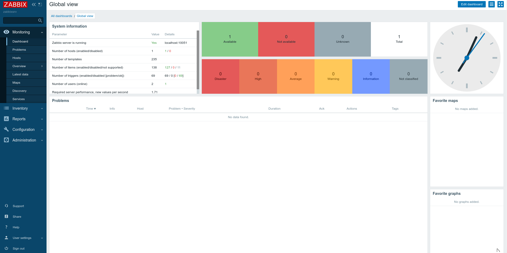

# **Deploy: Zabbix + Mysql + Wordpress com Vagrant e Ansible.**
<p>&nbsp;</p>

- [**Deploy: Zabbix + Mysql + Wordpress com Vagrant e Ansible.**](#deploy-zabbix--mysql--wordpress-com-vagrant-e-ansible)
  - [**Introdução**](#introdução)
  - [**1. Passos iniciais do laboratório.**](#1-passos-iniciais-do-laboratório)
  - [2. **Vagrant** - Provisionamento de máquinas virtuais.](#2-vagrant---provisionamento-de-máquinas-virtuais)
  - [3. Configuração das máquinas virtuais com o **Ansible**.](#3-configuração-das-máquinas-virtuais-com-o-ansible)
    - [3.1 - Servidor **mysqldb**](#31---servidor-mysqldb)
    - [**3.2 - Servidor Zabbix**](#32---servidor-zabbix)
    - [**3.3 - Servidor Wordpress**](#33---servidor-wordpress)
    - [**3.4 - Definindo as variáveis do ambiente.**](#34---definindo-as-variáveis-do-ambiente)
  - [**4 - Execução do ambiente de testes.**](#4---execução-do-ambiente-de-testes)
    - [**4.1 - Executando o Ansible.**](#41---executando-o-ansible)
    - [**4.2 - Verificando se o ambiente está no ar.**](#42---verificando-se-o-ambiente-está-no-ar)
  - [**5 - Conclusão**](#5---conclusão)

<p>&nbsp;</p>

## **Introdução**

O intuito deste artigo é ajudar a pessoas como eu que estão entrando no mundo DevOps a ter uma visão geral de como contruir um ambiente de laboratório, utilizando para provisão de maquinas virtuais o Vagrant e o Ansible para fazer a configuração deste ambiente.

Deixo claro que a idéia deste artigo é mostrar o rápido deploy de um ambiente efemero para testes, o que é muito utilizado nesta área.

Deixarei o código fonte deste artigo em meu repositório no github como material de apoio e para tirar possíveis dúvidas de vocês.

Para nosso laboratório, iremos criar uma pasta chamada “Laboratorio”, onde iremos colocar todos os arquivos, pastas deste laboratório. 

Utilizarei como host deste laboratório o sistema operacional Linux.
<p>&nbsp;</p>

## **1. Passos iniciais do laboratório.**

* Crie a pasta local chamada **“Labs”**:

```zsh
mkdir /Labs
``` 

* Entre na pasta **“Labs”** e crie uma sub-pasta chamada **“configs”**:

```zsh
cd /Labs
mkdir configs
```

* Iremos criar agora as chaves privadas e publicas do ssh que serão utilizadas no nosso laboratório, para isso iremos primeiramente entrar na sub-pasta **“configs”**, copiar o nosso path e utilizar o utilitário **ssh-keygen** para a criação das mesmas:

```zsh
cd configs
pwd

/Labs/configs >>copie este caminho para área de transferência 
```
* Agora rode o comando *ssh-keygen* para criar as chaves:

```zsh
ssh-keygen -t rsa
```
Irá aparecer a tela abaixo, nela, cole o caminho que você copiou anteriormente como mostrado abaixo:

```zsh
Generating public/private rsa key pair.
Enter file in which to save the key (/home/melquis/.ssh/id_rsa): /home/melquis/configs/id_rsa
Enter passphrase (empty for no passphrase): 
Enter same passphrase again: 
Your identification has been saved in /home/melquis/configs/id_rsa
Your public key has been saved in /home/melquis/configs/id_rsa.pub
The key fingerprint is:
######################################
######################################
######################################
```

* Liste o conteúdo da subpasta e você verá que existem dois arquivo de chaves ssh, uma privada e outra publica. Devemos alterar a permissão da chave privada para que somente o proprietário do arquivo consiga modificá-lo. Isto é um pré-requisito de segurança utilizado pelas ferramentas deste laboratório.

```zsh
ls -la                                                                                                                     ─╯
.rw------- 2,6k melquis 18 mar 17:41  id_rsa
.rw-r--r--  584 melquis 18 mar 17:41  id_rsa.pub
```

* Agora, rode o comando **chmod** para alterar as permissões:

```zsh
chmod 600 id_rsa
```

Agora podemos ir para os próximos passos.
<p>&nbsp;</p>

## 2. **Vagrant** - Provisionamento de máquinas virtuais.

O **Vagrant** é uma ferramenta desenvolvida pela empresa Hashicorp, a mesma do Terraform, que tem como finalidade prover máquinas virtuais e que pode ser utilizada com vários providers diferentes, entre eles podemos citar: **Microsoft Hyper-V**, **Virtualbox**, **Libvirt** e **Docker**.
Para mais informações sobre a utilização de providers, acesse:
 https://www.vagrantup.com/docs/providers.

Neste laboratório, iremos criar três máquinas virtuais utilizando como provider o **Virtualbox**, sendo:

* Uma máquina para banco de dados utilizando o Mysql;
* Uma máquina para o uso do Zabbix;
* Uma máquina para o uso do Wordpress.

Para todas elas, irei utilizar o **Ubuntu Focal** que é a ultima versão LTS disponível no momento que escrevo este artigo.

O **Vagrant** utiliza como arquivo de configuração um arquivo com o nome **Vagrantfile**, onde nele passamos as configurações referentes as máquinas virtuais que queremos criar.

Abaixo, segue o conteudo comentado do arquivo **Vagrantfile** do nosso laboratório:

```zsh
# Configurações globais do Vagrant
Vagrant.configure("2") do |config|

config.vm.box = "ubuntu/focal64" # Aqui dizemos qual imagem o Vagrant deve utilizar para criar as máquinas virtuais. 

config.vm.provider "virtualbox" do |vb| # Aqui dizemos para o Vagrant utilizar como provider o Virtualbox.

vb.memory = 1024 # Aqui dizemos para o Vagrant a quantidade de memória RAM que queremos utilizar em nossas maquinas virtuais.

vb.cpus = 1 # Aqui definimos a quantidade de CPUs que cada máquina virtual terá.
end

# Configurações da máquina virtual “wordpress”
config.vm.define "wordpress" do |wordpress| # Aqui definimos o nome da máquina virtual como wordpress.

wordpress.vm.network "public_network", ip: "192.168.0.33", bridge: "wlp3s0" # Neste ponto definimos para que seja criado a máquina utilizando uma rede publica, neste caso a minha rede doméstica, um endereço ip para a mesma e qual a placa que fará o bridge para a rede doméstica.
 
wordpress.vm.provision "shell", inline: "cat /configs/id_rsa.pub >> .ssh/authorized_keys" # Neste ponto, falamos para Vagrant copiar a nossa chave publica criada anteriormente para dentro do nosso arquivo de chaves ssh autorizadas a conectar com nosso host.

wordpress.vm.synced_folder "./configs", "/configs" # Aqui pediremos para o Vagrant compartilhar e sincronizar o conteudo da pasta local “configs” com a pasta da máquina virtual também chamada “configs”. Isto será muito utilizada durante o decorrer do nosso laboratório.
end

# Configurações da máquina virtual “mysqldb”
config.vm.define "mysqldb" do |mysqldb| # Aqui definimos o nome da máquina virtual como mysqldb.

mysqldb.vm.network "public_network", ip: "192.168.0.34", bridge: "wlp3s0" # Neste ponto definimos para que seja criado a máquina utilizando uma rede publica, neste caso a minha rede doméstica, um endereço ip para a mesma e qual a placa que fará o bridge para a rede doméstica.

mysqldb.vm.provision "shell", inline: "cat /configs/id_rsa.pub >> .ssh/authorized_keys" # Neste ponto, falamos para Vagrant copiar a nossa chave publica criada anteriormente para dentro do nosso arquivo de chaves ssh autorizadas a conectar com nosso host.

mysqldb.vm.synced_folder "./configs", "/configs" # Aqui pediremos para o Vagrant compartilhar e sincronizar o conteudo da pasta local “configs” com a pasta da máquina virtual também chamada “configs”. Isto será muito utilizada durante o decorrer do nosso laboratório.
end 

# Configurações da máquina virtual “zabbix”
config.vm.define "zabbix" do |zabbix| # Aqui definimos o nome da máquina virtual como zabbix.

zabbix.vm.network "public_network", ip: "192.168.0.36", bridge: "wlp3s0" # Neste ponto definimos para que seja criado a máquina utilizando uma rede publica, neste caso a minha rede doméstica, um endereço ip para a mesma e qual a placa que fará o bridge para a rede doméstica.

zabbix.vm.provision "shell", inline: "cat /configs/id_rsa.pub >> .ssh/authorized_keys" # Neste ponto, falamos para Vagrant copiar a nossa chave publica criada anteriormente para dentro do nosso arquivo de chaves ssh autorizadas a conectar com nosso host.

zabbix.vm.synced_folder "./configs", "/configs" # Aqui pediremos para o Vagrant compartilhar e sincronizar o conteudo da pasta local “configs” com a pasta da máquina virtual também chamada “configs”. Isto será muito utilizada durante o decorrer do nosso laboratório.

zabbix.vm.provider "virtualbox" do |vb| # Por se tratar do servidor Zabbix, iremos passar algumas configurações adicionais, como a utilização de mais memória RAM e CPUs. Obs: As configurações de máquina virtual sobrepoem as configurações globais.

vb.memory = 8192 # Aqui dizemos para o Vagrant a quantidade de memória RAM que queremos utilizar em nossas maquinas virtuais.

vb.cpus = 6 # Aqui definimos a quantidade de CPUs que cada máquina virtual terá.
end
end
end
```

Crie o arquivo Vagranfile com o editor de sua preferencia e cole o conteúdo abaixo:

```zsh
Vagrant.configure("2") do |config|
  config.vm.box = "ubuntu/focal64"
  config.vm.provider "virtualbox" do |vb|
    vb.memory = 1024
    vb.cpus = 1
  end

  config.vm.define "wordpress" do |wordpress|
    wordpress.vm.network "public_network", ip: "192.168.0.33", bridge: "wlp3s0"
    wordpress.vm.provision "shell", inline: "cat /configs/id_rsa.pub >> .ssh/authorized_keys"
    wordpress.vm.synced_folder "./configs", "/configs"
  end

  config.vm.define "mysqldb" do |mysqldb|
    mysqldb.vm.network "public_network", ip: "192.168.0.34", bridge: "wlp3s0"
    mysqldb.vm.provision "shell", inline: "cat /configs/id_rsa.pub >> .ssh/authorized_keys"
    mysqldb.vm.synced_folder "./configs", "/configs"
  end  
 
  config.vm.define "zabbix" do |zabbix|
    zabbix.vm.network "public_network", ip: "192.168.0.36", bridge: "wlp3s0"
    zabbix.vm.provision "shell", inline: "cat /configs/id_rsa.pub >> .ssh/authorized_keys"
    zabbix.vm.synced_folder "./configs", "/configs"
      
    zabbix.vm.provider "virtualbox" do |vb|
      vb.memory = 8192
      vb.cpus = 6
    end
  end
end
```

Altere os itens **“ip:”** para os IPs de sua rede local e a interface **bridge** para a interface conectada a rede em seu host.

Salve o arquivo e abra um terminal dentro da pasta **“Labs”** e digite o comando ***"vagrant status"*** para verificar se o arquivo esta correto. Isso mostrará o status das maquinas passadas pelo arquivo de configuração Vagrantfile e mostrará as mesmas como não criadas ainda:

```zsh
vagrant status                                                                                                             ─╯
Current machine states:

wordpress                 not created (virtualbox)
mysqldbdb                 not created (virtualbox)
zabbix                    not created (virtualbox)

This environment represents multiple VMs. The VMs are all listed
above with their current state. For more information about a specific
VM, run `vagrant status NAME`.
```

O próximo passo é a criação das maquinas, para isso, utilizamos o comando **“vagrant up”** para que o **Vagrant** puxe a imagem do **Ubuntu Focal** e crie as mesmas.

Abaixo, segue a sequencia do processo de criação das máquinas:

```zsh
vagrant up                                                                                                                 ─╯
Bringing machine 'wordpress' up with 'virtualbox' provider...
Bringing machine 'mysqldbdb' up with 'virtualbox' provider...
Bringing machine 'zabbix' up with 'virtualbox' provider...
==> wordpress: Importing base box 'ubuntu/focal64'...
==> wordpress: Matching MAC address for NAT networking...
==> wordpress: Checking if box 'ubuntu/focal64' version '20220315.0.0' is up to date...
==> wordpress: Setting the name of the VM: Labs_wordpress_1647638546172_81178
==> wordpress: Clearing any previously set network interfaces...
==> wordpress: Preparing network interfaces based on configuration...
    wordpress: Adapter 1: nat
    wordpress: Adapter 2: bridged
==> wordpress: Forwarding ports...
    wordpress: 22 (guest) => 2222 (host) (adapter 1)
==> wordpress: Running 'pre-boot' VM customizations...
==> wordpress: Booting VM...
==> wordpress: Waiting for machine to boot. This may take a few minutes...
    wordpress: SSH address: 127.0.0.1:2222
    wordpress: SSH username: vagrant
    wordpress: SSH auth method: private key
    wordpress: Warning: Connection reset. Retrying...
    wordpress: Warning: Remote connection disconnect. Retrying...
    wordpress: 
    wordpress: Vagrant insecure key detected. Vagrant will automatically replace
    wordpress: this with a newly generated keypair for better security.
    wordpress: 
    wordpress: Inserting generated public key within guest...
    wordpress: Removing insecure key from the guest if it's present...
    wordpress: Key inserted! Disconnecting and reconnecting using new SSH key...
==> wordpress: Machine booted and ready!
==> wordpress: Checking for guest additions in VM...
==> wordpress: Configuring and enabling network interfaces...
==> wordpress: Mounting shared folders...
    wordpress: /configs => /home/melquis/Labs/configs
    wordpress: /vagrant => /home/melquis/Labs
==> wordpress: Running provisioner: shell...
    wordpress: Running: inline script
==> mysqldb: Importing base box 'ubuntu/focal64'...
==> mysqldb: Matching MAC address for NAT networking...
==> mysqldb: Checking if box 'ubuntu/focal64' version '20220315.0.0' is up to date...
==> mysqldb: Setting the name of the VM: Labs_mysqldb_1647639121852_68154
==> mysqldb: Fixed port collision for 22 => 2222. Now on port 2200.
==> mysqldb: Clearing any previously set network interfaces...
==> mysqldb: Preparing network interfaces based on configuration...
    mysqldb: Adapter 1: nat
    mysqldb: Adapter 2: bridged
==> mysqldb: Forwarding ports...
    mysqldb: 22 (guest) => 2200 (host) (adapter 1)
==> mysqldb: Running 'pre-boot' VM customizations...
==> mysqldb: Booting VM...
==> mysqldb: Waiting for machine to boot. This may take a few minutes...
    mysqldb: SSH address: 127.0.0.1:2200
    mysqldb: SSH username: vagrant
    mysqldb: SSH auth method: private key
    mysqldb: Warning: Remote connection disconnect. Retrying...
    mysqldb: Warning: Connection reset. Retrying...
    mysqldb: 
    mysqldb: Vagrant insecure key detected. Vagrant will automatically replace
    mysqldb: this with a newly generated keypair for better security.
    mysqldb: 
    mysqldb: Inserting generated public key within guest...
    mysqldb: Removing insecure key from the guest if it's present...
    mysqldb: Key inserted! Disconnecting and reconnecting using new SSH key...
==> mysqldb: Machine booted and ready!
==> mysqldb: Checking for guest additions in VM...
==> mysqldb: Configuring and enabling network interfaces...
==> mysqldb: Mounting shared folders...
    mysqldb: /configs => /home/melquis/Labs/configs
    mysqldb: /vagrant => /home/melquis/Labs
==> mysqldb: Running provisioner: shell...
    mysqldb: Running: inline script
==> zabbix: Importing base box 'ubuntu/focal64'...
==> zabbix: Matching MAC address for NAT networking...
==> zabbix: Checking if box 'ubuntu/focal64' version '20220315.0.0' is up to date...
==> zabbix: Setting the name of the VM: Labs_zabbix_1647639164418_12784
==> zabbix: Fixed port collision for 22 => 2222. Now on port 2201.
==> zabbix: Clearing any previously set network interfaces...
==> zabbix: Preparing network interfaces based on configuration...
    zabbix: Adapter 1: nat
    zabbix: Adapter 2: bridged
==> zabbix: Forwarding ports...
    zabbix: 22 (guest) => 2201 (host) (adapter 1)
==> zabbix: Running 'pre-boot' VM customizations...
==> zabbix: Booting VM...
==> zabbix: Waiting for machine to boot. This may take a few minutes...
    zabbix: SSH address: 127.0.0.1:2201
    zabbix: SSH username: vagrant
    zabbix: SSH auth method: private key
    zabbix: Warning: Connection reset. Retrying...
    zabbix: Warning: Remote connection disconnect. Retrying...
    zabbix: 
    zabbix: Vagrant insecure key detected. Vagrant will automatically replace
    zabbix: this with a newly generated keypair for better security.
    zabbix: 
    zabbix: Inserting generated public key within guest...
    zabbix: Removing insecure key from the guest if it's present...
    zabbix: Key inserted! Disconnecting and reconnecting using new SSH key...
==> zabbix: Machine booted and ready!
==> zabbix: Checking for guest additions in VM...
==> zabbix: Configuring and enabling network interfaces...
==> zabbix: Mounting shared folders...
    zabbix: /configs => /home/melquis/Labs/configs
    zabbix: /vagrant => /home/melquis/Labs
==> zabbix: Running provisioner: shell...
    zabbix: Running: inline script
```

Criado as máquinas virtuais, iremos rodar novamente o comando **“vagrant status”** para vermos se tudo ocorreu bem:

```zsh
vagrant status                                                                                                             ─╯
Current machine states:

wordpress                 running (virtualbox)
mysqldb                   running (virtualbox)
zabbix                    running (virtualbox)

This environment represents multiple VMs. The VMs are all listed
above with their current state. For more information about a specific
VM, run `vagrant status NAME`.
```

Teste as conexões via ssh com as máquinas recém criadas, passando a chave ssh privada que criamos no inicio do artigo:

```zsh
ssh -i configs/id_rsa vagrant@192.168.0.33                                                                                 ─╯
The authenticity of host '192.168.0.33 (192.168.0.33)' can't be established.
ECDSA key fingerprint is SHA256:JvVmYrn5GubINqL8fqv2WN3dtNPHLgAMFi7nGbG4ZYE.
Are you sure you want to continue connecting (yes/no/[fingerprint])? yes
Warning: Permanently added '192.168.0.33' (ECDSA) to the list of known hosts.
Welcome to Ubuntu 20.04.4 LTS (GNU/Linux 5.4.0-104-generic x86_64)

 * Documentation:  https://help.ubuntu.com
 * Management:     https://landscape.canonical.com
 * Support:        https://ubuntu.com/advantage

  System information as of Fri Mar 18 21:38:37 UTC 2022

  System load:             0.0
  Usage of /:              3.4% of 38.71GB
  Memory usage:            19%
  Swap usage:              0%
  Processes:               104
  Users logged in:         0
  IPv4 address for enp0s3: 10.0.2.15
  IPv4 address for enp0s8: 192.168.0.33
  IPv6 address for enp0s8: 2804:14c:4e8:9475:a00:27ff:fe24:3ac7


1 update can be applied immediately.
To see these additional updates run: apt list --upgradable


vagrant@ubuntu-focal:~$
```

Observe que ao executar o comando, iremos “cair” dentro do terminal da máquina virtual. Não execute nenhum comando neste terminal, iremos fazer a configuração das maquinas virtuais com o **Ansible** nos próximos passos.
Neste terminal, digite o comando **“exit”** para sair da sessão ssh da máquina virtual.

Faça o passo acima para testar a conexão com as demais maquinas.
<p>&nbsp;</p>

## 3. Configuração das máquinas virtuais com o **Ansible**.

O **Ansible** é uma ferramenta de código aberto da **Red Hat** usada para automatizar e configurar servidores, onde através de arquivos chamados **playbooks**, dizemos ao **Ansible** o que deve ser implementado e configurado em um determinado servidor ou um grupo de servidores.

Para que o **Ansible** saiba qual máquina configurar, é necessário informá-lo através de um arquivo de inventário, onde passamos informações como **nome da máquina**, **ip**, **usuário** para conexão e etc.

A ferramenta utiliza uma linguagem declarativa escrita em **YAML**, por isso, todos os seus arquivos tem como extensão o **.yaml** ou **.yml**.

O **Ansible** trabalha com a seguinte estrutura de diretórios que explicarei abaixo:

* **roles** = Permite que carregamos automaticamente variáveis de ambiente **(vars)**, arquivos **(files)**, tarefas **(tasks)**, manipuladores **(handlers)**, **templates** e outros artefados do **Ansible**.
Dentro do diretório roles temos ainda uma estrutura de subpastas ou subdiretórios sendo ela:

  - tasks: contém uma lista de tarefas a serem executadas por uma função (role);

  - handlers: contém uma lista de manipuladores (handlers) que podem ser usados por uma função;

  - files: contém os arquivos que podem ser implementados por meio dessa função;

  - templates: contém modelos que podem ser implantados por meio dessa função.

Para mais informações sobre funções do Ansible, veja a página de documentação da ferramenta em https://docs.ansible.com/ansible/latest/user_guide/playbooks_reuse_roles.html#roles

* **group_vars** = Neste diretório passamos para o **Ansible** as váriaveis de ambiente que iremos usar tanto de forma individual para cada servidor como também de forma global envolvendo todos os servidores descritos no arquivo de inventário.

Com a breve descrição acima sobre a estrutura de diretórios usados pelo ansible, vamos criar dentro do diretório **“Labs”** o subdiretório **“roles”**.

```zsh
mkdir roles
```

Iremos começar nossas configurações pelo servidor de banco de dados chamado neste artigo de **“mysqldb”**.
<p>&nbsp;</p>

### 3.1 - Servidor **mysqldb**

Dentro do diretório **“roles”** vamos cria o diretório chamado **“mysqldb”** que é o nome do nosso servidor de banco de dados que irá prover os bancos dos servidores **Zabbix** e **Wordpress**.

```zsh
cd roles
```

```zsh
mkdir mysqldb
```

```zsh
cd mysqldb
```

Dentro dele, criaremos os diretórios **tasks**, **handlers**, **files** e **defaults**.

```zsh
mkdir tasks handlers files defaults
```

Agora vamos listar o conteudo da pasta mysqldb e veremos os subdiretórios criados:

```zsh
ls -la                                                                                                                     ─╯
drwxr-xr-x - melquis 18 mar 19:05  defaults
drwxr-xr-x - melquis 18 mar 19:05  files
drwxr-xr-x - melquis 18 mar 19:05  handlers
drwxr-xr-x - melquis 18 mar 19:05  tasks
```

Entre no diretório **tasks** do servidor **mysqldb** e com a ajuda de um editor de códigos de sua preferência, no meu caso irei utilizar o **Microsoft Visual Studio Code** e crie o arquivo main.yml com o seguinte conteúdo abaixo:

```yaml
---
- name: 'Instala pacotes de dependencia do sistema operacional'
  apt:
    update_cache: yes
    name:
    - mysql-server-8.0
    - python3-mysqldb
    - php7.4-mysql
    state: latest
  become: yes

# Cria banco e usuario para uso do Wordpress
- name: 'Cria o banco do Wordpress'
  mysql_db:
    name: "{{ wp_db_name }}"
    state: present
  become: yes

- name: 'Cria usuario wordpress no mysql'
  mysql_user:
    name: "{{ wp_username }}"
    password: "{{ wp_user_password }}"
    priv: "{{ wp_db_name }}.*:ALL"
    state: present
    host: "{{ item }}"
  with_items:
    - "{{ wp_host_ip }}"
  become: yes

# Cria banco e usuario para uso do Zabbix
- name: 'Cria o banco do Zabbix'
  mysql_db:
    name: "{{ zb_db_name }}"
    encoding: utf8
    collation: utf8_bin
    state: present
  become: yes

- name: 'Cria usuario zabbix no mysql'
  mysql_user:
    name: "{{ zb_username }}"
    password: "{{ zb_user_password }}"
    priv: "{{ zb_db_name }}.*:ALL"
    state: present
    host: "{{ item }}"
  with_items:
    - "{{ zb_host_ip }}"
  become: yes

- name: 'Configura my.cnf para local'
  copy:
    src: 'files/mysqld.cnf'
    dest: '/etc/mysql/mysql.conf.d/mysqld.cnf'
    force: yes
  become: yes
  notify:
    - restart mysql

- name: 'Baixa o arquivo de repositorio do Zabbix'
  get_url:
    url: 'https://repo.zabbix.com/zabbix/5.4/ubuntu/pool/main/z/zabbix-release/zabbix-release_5.4-1+ubuntu20.04_all.deb'
    dest: '/tmp/zabbix-release_5.4-1+ubuntu20.04_all.deb'
    mode: 0440
  become: yes

- name: 'Instala o arquivo de repositorio do Zabbix'
  apt: 
    deb: /tmp/zabbix-release_5.4-1+ubuntu20.04_all.deb
  become: yes    


- name: 'Instala pacotes de conexão e agente do zabbix no servidor'
  apt:
    update_cache: yes
    name:
      - zabbix-agent
      - zabbix-sql-scripts
    state: latest
  become: yes

- name: 'Copia o arquivo de schema para diretorio temporario'
  copy:
    src: /usr/share/doc/zabbix-sql-scripts/mysql/create.sql.gz
    dest: /tmp/create.sql.gz
    remote_src: yes
  become: yes

- name: 'Descompacta script de criação de schema do Zabbix'
  shell: gzip -f -d /tmp/create.sql.gz 
  #state: import
  become: yes
  
- name: 'Importa o Schema do Zabbix'
  mysql_db:
    name: "{{ zb_db_name }}"
    state: import
    target: /tmp/create.sql
    force: yes
  become: yes
  notify:
    - restart mysql
```

Como podemos ver, neste arquivo, cada item da lista de tarefas já é descrito o que o item irá fazer. Nesta task usamos os módulos **apt**, **mysql_db**, **mysql_user**, **copy**, **get_url** e **shell** para configurar o nosso servidor.
Segue abaixo uma breve explicação do que cada um destes módulos fazem:

* **Módulo apt**: é responsável por atualizar e instalar os pacotes no servidor. Como usamos uma base Ubuntu, o gerenciamento de pacotes do mesmo é feito pelo utilitário apt.
  
* **Módulo mysql_db**: é responsável pela criação do banco de dados, importação e exportação de schemas de banco.

* **Módulo mysql_user**: é responsável pela criação de usuários no banco de dados e modificar as permissões do mesmo no banco.

* **Módulo copy**: é responsável por copiar um determinado item para dentro do servidor, onde passamos uma origem e um destino para o mesmo.

* **Módulo get_url**: é responsável pelo download de um determinado item para dentro do servidor. Neste módulo, é passado a origem da url e o local onde queremos salvar o item.

* **Módulo shell**: é responsável pela execução via terminal de dentro do servidor, com ele podemos executar comandos e shell-scripts.

Todos os itens desta lista de tarefas são executados como usuário root, que é o administrador do servidor, com o uso do parâmetro **“become: yes”**.

Para mais informações sobre o uso de módulos no **Ansible**, veja a documentação do mesmo em:
https://docs.ansible.com/

O próximo passo será criar no diretório **“mysqldb”** o subdiretório **“files”** onde criaremos um arquivo chamado **mysqld.cnf** com o seguinte conteúdo abaixo:

```zsh
[mysqld]
user		= mysql
bind-address		= 0.0.0.0
key_buffer_size		= 16M
myisam-recover-options  = BACKUP
log_error = /var/log/mysql/error.log
max_binlog_size   = 100M
```

Neste arquivo, para fins de laboratório, foi liberado o acesso externo ao banco para qualquer ip, mas para uso em produção, você deve colocar somente o ip ou a rede de sua empresa por medida de segurança.

Volte para o diretório **“mysqldb”** e crie um subdiretório chamado **“handlers”** e dentro dele um arquivo chamado **“main.yml”** com o conteúdo abaixo:

```yaml
---
- name: restart mysql
  service:
    name: mysql
    state: restarted
  become: yes
```
O arquivo **main.yml** do diretório **“handlers”** é lido toda vez que houver alguma alteração no item da lista de tarefas que tenha o parâmetro **“notify: restart mysql”** do arquivo **main.yml** do diretório **“tasks”**.
Neste caso, em especifico, ele irá reiniciar o serviço do **mysql** após a cópia do arquivo **mysqld.cnf** e da importação do schema do banco do **Zabbix**.

O ultimo item que iremos criar é o subdiretório **“defaults”** dentro do diretório **“myslqdb”**, onde iremos criar um arquivo **main.yml** com uma lista de itens que utilizamos no arquivo **main.yml** do diretório **“tasks”**.

```yaml
---
wp_host_ip:
zb_host_ip:
- localhost
- '127.0.0.1'
```

Terminado a configuração dos arquivos do servidor **“mysqldb”** o próximo passo será criar o diretório **zabbix**, que será usado para fazermos a implantação dos serviços do servidor **Zabbix**.
<p>&nbsp;</p>

### **3.2 - Servidor Zabbix**

Dentro do diretório **"roles"**, vamos criar o subdiretório chamado **zabbix**, que é o nome do nosso servidor de monitoramento.

```zsh
mkdir zabbix
```

Dentro dele, iremos crias os subdiretórios: **tasks**, **handlers** e **files**.

```zsh
cd zabbix
```

```zsh
mkdir tasks handlers files
```

Execute o comando **ls** para verificarmos se todos os subdireórios foram criados com sucesso:

```zsh
ls -la                                                                                                                     ─╯
drwxr-xr-x - melquis 19 mar 13:15  files
drwxr-xr-x - melquis 19 mar 13:15  handlers
drwxr-xr-x - melquis 19 mar 13:15  tasks
```

Entre no diretório tasks do servidor **zabbix** e com a ajuda de um editor de códigos de sua preferência, no meu caso irei utilizar o **Microsoft Visual Studio Code** e crie o arquivo **main.yml** com o seguinte conteudo abaixo:

```yaml
---
- name: 'Instala pacotes de dependencias do sistema operacional'
  apt:
    update_cache: yes
    name:
    - php7.4
    - apache2
    - php7.4-mbstring
    - php7.4-gd
    - php7.4-xml
    - php7.4-bcmath
    - php7.4-ldap
    - php7.4-mysql
    state: latest
  become: yes
  
- name: 'Configura o arquivo php.ini'
  copy:
    src: 'files/php.ini'
    dest: '/etc/php/7.4/apache2/php.ini'
  become: yes
  notify:
    - restart apache2

- name: 'Baixa o arquivo de repositorio do Zabbix'
  get_url:
    url: 'https://repo.zabbix.com/zabbix/5.4/ubuntu/pool/main/z/zabbix-release/zabbix-release_5.4-1+ubuntu20.04_all.deb'
    dest: '/tmp/zabbix-release_5.4-1+ubuntu20.04_all.deb'
    mode: 0440
  become: yes

- name: 'Instala o arquivo de repositorio do Zabbix'
  apt: 
    deb: /tmp/zabbix-release_5.4-1+ubuntu20.04_all.deb
  become: yes    

- name: 'Instala os pacotes do Zabbix no servidor'
  apt:
    update_cache: yes
    name:
    - zabbix-server-mysql
    - zabbix-frontend-php
    - zabbix-apache-conf
    - zabbix-sql-scripts
    - zabbix-agent
    state: latest
  become: yes

- name: 'Copia o arquivo zabbix_server.conf para o servidor'
  copy:
    src: 'files/zabbix_server.conf'
    dest: '/etc/zabbix/zabbix_server.conf'
  become: yes
  notify:
    - restart apache2
    - restart zabbix-server
```

Para detalhes sobre o uso desses módulos, veja o descritivo acima nas configurações do servidor **Mysqldb** ou em https://docs.ansible.com/.

O próximo passo será criar no diretório **“zabbix”** o subdiretório **“files”** onde criaremos um arquivo chamado **php.ini** com o seguinte conteudo abaixo:

```zsh
[PHP]

;;;;;;;;;;;;;;;;;;;
; About php.ini   ;
;;;;;;;;;;;;;;;;;;;
; PHP's initialization file, generally called php.ini, is responsible for
; configuring many of the aspects of PHP's behavior.

; PHP attempts to find and load this configuration from a number of locations.
; The following is a summary of its search order:
; 1. SAPI module specific location.
; 2. The PHPRC environment variable. (As of PHP 5.2.0)
; 3. A number of predefined registry keys on Windows (As of PHP 5.2.0)
; 4. Current working directory (except CLI)
; 5. The web server's directory (for SAPI modules), or directory of PHP
; (otherwise in Windows)
; 6. The directory from the --with-config-file-path compile time option, or the
; Windows directory (usually C:\windows)
; See the PHP docs for more specific information.
; http://php.net/configuration.file

; The syntax of the file is extremely simple.  Whitespace and lines
; beginning with a semicolon are silently ignored (as you probably guessed).
; Section headers (e.g. [Foo]) are also silently ignored, even though
; they might mean something in the future.

; Directives following the section heading [PATH=/www/mysite] only
; apply to PHP files in the /www/mysite directory.  Directives
; following the section heading [HOST=www.example.com] only apply to
; PHP files served from www.example.com.  Directives set in these
; special sections cannot be overridden by user-defined INI files or
; at runtime. Currently, [PATH=] and [HOST=] sections only work under
; CGI/FastCGI.
; http://php.net/ini.sections

; Directives are specified using the following syntax:
; directive = value
; Directive names are *case sensitive* - foo=bar is different from FOO=bar.
; Directives are variables used to configure PHP or PHP extensions.
; There is no name validation.  If PHP can't find an expected
; directive because it is not set or is mistyped, a default value will be used.

; The value can be a string, a number, a PHP constant (e.g. E_ALL or M_PI), one
; of the INI constants (On, Off, True, False, Yes, No and None) or an expression
; (e.g. E_ALL & ~E_NOTICE), a quoted string ("bar"), or a reference to a
; previously set variable or directive (e.g. ${foo})

; Expressions in the INI file are limited to bitwise operators and parentheses:
; |  bitwise OR
; ^  bitwise XOR
; &  bitwise AND
; ~  bitwise NOT
; !  boolean NOT

; Boolean flags can be turned on using the values 1, On, True or Yes.
; They can be turned off using the values 0, Off, False or No.

; An empty string can be denoted by simply not writing anything after the equal
; sign, or by using the None keyword:

; foo =         ; sets foo to an empty string
; foo = None    ; sets foo to an empty string
; foo = "None"  ; sets foo to the string 'None'

; If you use constants in your value, and these constants belong to a
; dynamically loaded extension (either a PHP extension or a Zend extension),
; you may only use these constants *after* the line that loads the extension.

;;;;;;;;;;;;;;;;;;;
; About this file ;
;;;;;;;;;;;;;;;;;;;
; PHP comes packaged with two INI files. One that is recommended to be used
; in production environments and one that is recommended to be used in
; development environments.

; php.ini-production contains settings which hold security, performance and
; best practices at its core. But please be aware, these settings may break
; compatibility with older or less security conscience applications. We
; recommending using the production ini in production and testing environments.

; php.ini-development is very similar to its production variant, except it is
; much more verbose when it comes to errors. We recommend using the
; development version only in development environments, as errors shown to
; application users can inadvertently leak otherwise secure information.

; This is the php.ini-production INI file.

;;;;;;;;;;;;;;;;;;;
; Quick Reference ;
;;;;;;;;;;;;;;;;;;;
; The following are all the settings which are different in either the production
; or development versions of the INIs with respect to PHP's default behavior.
; Please see the actual settings later in the document for more details as to why
; we recommend these changes in PHP's behavior.

; display_errors
;   Default Value: On
;   Development Value: On
;   Production Value: Off

; display_startup_errors
;   Default Value: Off
;   Development Value: On
;   Production Value: Off

; error_reporting
;   Default Value: E_ALL & ~E_NOTICE & ~E_STRICT & ~E_DEPRECATED
;   Development Value: E_ALL
;   Production Value: E_ALL & ~E_DEPRECATED & ~E_STRICT

; log_errors
;   Default Value: Off
;   Development Value: On
;   Production Value: On

; max_input_time
;   Default Value: -1 (Unlimited)
;   Development Value: 60 (60 seconds)
;   Production Value: 60 (60 seconds)

; output_buffering
;   Default Value: Off
;   Development Value: 4096
;   Production Value: 4096

; register_argc_argv
;   Default Value: On
;   Development Value: Off
;   Production Value: Off

; request_order
;   Default Value: None
;   Development Value: "GP"
;   Production Value: "GP"

; session.gc_divisor
;   Default Value: 100
;   Development Value: 1000
;   Production Value: 1000

; session.sid_bits_per_character
;   Default Value: 4
;   Development Value: 5
;   Production Value: 5

; short_open_tag
;   Default Value: On
;   Development Value: Off
;   Production Value: Off

; variables_order
;   Default Value: "EGPCS"
;   Development Value: "GPCS"
;   Production Value: "GPCS"

;;;;;;;;;;;;;;;;;;;;
; php.ini Options  ;
;;;;;;;;;;;;;;;;;;;;
; Name for user-defined php.ini (.htaccess) files. Default is ".user.ini"
;user_ini.filename = ".user.ini"

; To disable this feature set this option to an empty value
;user_ini.filename =

; TTL for user-defined php.ini files (time-to-live) in seconds. Default is 300 seconds (5 minutes)
;user_ini.cache_ttl = 300

;;;;;;;;;;;;;;;;;;;;
; Language Options ;
;;;;;;;;;;;;;;;;;;;;

; Enable the PHP scripting language engine under Apache.
; http://php.net/engine
engine = On

; This directive determines whether or not PHP will recognize code between
; <? and ?> tags as PHP source which should be processed as such. It is
; generally recommended that <?php and ?> should be used and that this feature
; should be disabled, as enabling it may result in issues when generating XML
; documents, however this remains supported for backward compatibility reasons.
; Note that this directive does not control the <?= shorthand tag, which can be
; used regardless of this directive.
; Default Value: On
; Development Value: Off
; Production Value: Off
; http://php.net/short-open-tag
short_open_tag = Off

; The number of significant digits displayed in floating point numbers.
; http://php.net/precision
precision = 14

; Output buffering is a mechanism for controlling how much output data
; (excluding headers and cookies) PHP should keep internally before pushing that
; data to the client. If your application's output exceeds this setting, PHP
; will send that data in chunks of roughly the size you specify.
; Turning on this setting and managing its maximum buffer size can yield some
; interesting side-effects depending on your application and web server.
; You may be able to send headers and cookies after you've already sent output
; through print or echo. You also may see performance benefits if your server is
; emitting less packets due to buffered output versus PHP streaming the output
; as it gets it. On production servers, 4096 bytes is a good setting for performance
; reasons.
; Note: Output buffering can also be controlled via Output Buffering Control
;   functions.
; Possible Values:
;   On = Enabled and buffer is unlimited. (Use with caution)
;   Off = Disabled
;   Integer = Enables the buffer and sets its maximum size in bytes.
; Note: This directive is hardcoded to Off for the CLI SAPI
; Default Value: Off
; Development Value: 4096
; Production Value: 4096
; http://php.net/output-buffering
output_buffering = 4096

; You can redirect all of the output of your scripts to a function.  For
; example, if you set output_handler to "mb_output_handler", character
; encoding will be transparently converted to the specified encoding.
; Setting any output handler automatically turns on output buffering.
; Note: People who wrote portable scripts should not depend on this ini
;   directive. Instead, explicitly set the output handler using ob_start().
;   Using this ini directive may cause problems unless you know what script
;   is doing.
; Note: You cannot use both "mb_output_handler" with "ob_iconv_handler"
;   and you cannot use both "ob_gzhandler" and "zlib.output_compression".
; Note: output_handler must be empty if this is set 'On' !!!!
;   Instead you must use zlib.output_handler.
; http://php.net/output-handler
;output_handler =

; URL rewriter function rewrites URL on the fly by using
; output buffer. You can set target tags by this configuration.
; "form" tag is special tag. It will add hidden input tag to pass values.
; Refer to session.trans_sid_tags for usage.
; Default Value: "form="
; Development Value: "form="
; Production Value: "form="
;url_rewriter.tags

; URL rewriter will not rewrite absolute URL nor form by default. To enable
; absolute URL rewrite, allowed hosts must be defined at RUNTIME.
; Refer to session.trans_sid_hosts for more details.
; Default Value: ""
; Development Value: ""
; Production Value: ""
;url_rewriter.hosts

; Transparent output compression using the zlib library
; Valid values for this option are 'off', 'on', or a specific buffer size
; to be used for compression (default is 4KB)
; Note: Resulting chunk size may vary due to nature of compression. PHP
;   outputs chunks that are few hundreds bytes each as a result of
;   compression. If you prefer a larger chunk size for better
;   performance, enable output_buffering in addition.
; Note: You need to use zlib.output_handler instead of the standard
;   output_handler, or otherwise the output will be corrupted.
; http://php.net/zlib.output-compression
zlib.output_compression = Off

; http://php.net/zlib.output-compression-level
;zlib.output_compression_level = -1

; You cannot specify additional output handlers if zlib.output_compression
; is activated here. This setting does the same as output_handler but in
; a different order.
; http://php.net/zlib.output-handler
;zlib.output_handler =

; Implicit flush tells PHP to tell the output layer to flush itself
; automatically after every output block.  This is equivalent to calling the
; PHP function flush() after each and every call to print() or echo() and each
; and every HTML block.  Turning this option on has serious performance
; implications and is generally recommended for debugging purposes only.
; http://php.net/implicit-flush
; Note: This directive is hardcoded to On for the CLI SAPI
implicit_flush = Off

; The unserialize callback function will be called (with the undefined class'
; name as parameter), if the unserializer finds an undefined class
; which should be instantiated. A warning appears if the specified function is
; not defined, or if the function doesn't include/implement the missing class.
; So only set this entry, if you really want to implement such a
; callback-function.
unserialize_callback_func =

; The unserialize_max_depth specifies the default depth limit for unserialized
; structures. Setting the depth limit too high may result in stack overflows
; during unserialization. The unserialize_max_depth ini setting can be
; overridden by the max_depth option on individual unserialize() calls.
; A value of 0 disables the depth limit.
;unserialize_max_depth = 4096

; When floats & doubles are serialized, store serialize_precision significant
; digits after the floating point. The default value ensures that when floats
; are decoded with unserialize, the data will remain the same.
; The value is also used for json_encode when encoding double values.
; If -1 is used, then dtoa mode 0 is used which automatically select the best
; precision.
serialize_precision = -1

; open_basedir, if set, limits all file operations to the defined directory
; and below.  This directive makes most sense if used in a per-directory
; or per-virtualhost web server configuration file.
; Note: disables the realpath cache
; http://php.net/open-basedir
;open_basedir =

; This directive allows you to disable certain functions for security reasons.
; It receives a comma-delimited list of function names.
; http://php.net/disable-functions
disable_functions = pcntl_alarm,pcntl_fork,pcntl_waitpid,pcntl_wait,pcntl_wifexited,pcntl_wifstopped,pcntl_wifsignaled,pcntl_wifcontinued,pcntl_wexitstatus,pcntl_wtermsig,pcntl_wstopsig,pcntl_signal,pcntl_signal_get_handler,pcntl_signal_dispatch,pcntl_get_last_error,pcntl_strerror,pcntl_sigprocmask,pcntl_sigwaitinfo,pcntl_sigtimedwait,pcntl_exec,pcntl_getpriority,pcntl_setpriority,pcntl_async_signals,pcntl_unshare,

; This directive allows you to disable certain classes for security reasons.
; It receives a comma-delimited list of class names.
; http://php.net/disable-classes
disable_classes =

; Colors for Syntax Highlighting mode.  Anything that's acceptable in
; <span style="color: ???????"> would work.
; http://php.net/syntax-highlighting
;highlight.string  = #DD0000
;highlight.comment = #FF9900
;highlight.keyword = #007700
;highlight.default = #0000BB
;highlight.html    = #000000

; If enabled, the request will be allowed to complete even if the user aborts
; the request. Consider enabling it if executing long requests, which may end up
; being interrupted by the user or a browser timing out. PHP's default behavior
; is to disable this feature.
; http://php.net/ignore-user-abort
;ignore_user_abort = On

; Determines the size of the realpath cache to be used by PHP. This value should
; be increased on systems where PHP opens many files to reflect the quantity of
; the file operations performed.
; Note: if open_basedir is set, the cache is disabled
; http://php.net/realpath-cache-size
;realpath_cache_size = 4096k

; Duration of time, in seconds for which to cache realpath information for a given
; file or directory. For systems with rarely changing files, consider increasing this
; value.
; http://php.net/realpath-cache-ttl
;realpath_cache_ttl = 120

; Enables or disables the circular reference collector.
; http://php.net/zend.enable-gc
zend.enable_gc = On

; If enabled, scripts may be written in encodings that are incompatible with
; the scanner.  CP936, Big5, CP949 and Shift_JIS are the examples of such
; encodings.  To use this feature, mbstring extension must be enabled.
; Default: Off
;zend.multibyte = Off

; Allows to set the default encoding for the scripts.  This value will be used
; unless "declare(encoding=...)" directive appears at the top of the script.
; Only affects if zend.multibyte is set.
; Default: ""
;zend.script_encoding =

; Allows to include or exclude arguments from stack traces generated for exceptions
; Default: Off
; In production, it is recommended to turn this setting on to prohibit the output 
; of sensitive information in stack traces
zend.exception_ignore_args = On

;;;;;;;;;;;;;;;;;
; Miscellaneous ;
;;;;;;;;;;;;;;;;;

; Decides whether PHP may expose the fact that it is installed on the server
; (e.g. by adding its signature to the Web server header).  It is no security
; threat in any way, but it makes it possible to determine whether you use PHP
; on your server or not.
; http://php.net/expose-php
expose_php = Off

;;;;;;;;;;;;;;;;;;;
; Resource Limits ;
;;;;;;;;;;;;;;;;;;;

; Maximum execution time of each script, in seconds
; http://php.net/max-execution-time
; Note: This directive is hardcoded to 0 for the CLI SAPI
max_execution_time = 300

; Maximum amount of time each script may spend parsing request data. It's a good
; idea to limit this time on productions servers in order to eliminate unexpectedly
; long running scripts.
; Note: This directive is hardcoded to -1 for the CLI SAPI
; Default Value: -1 (Unlimited)
; Development Value: 60 (60 seconds)
; Production Value: 60 (60 seconds)
; http://php.net/max-input-time
max_input_time = 60

; Maximum input variable nesting level
; http://php.net/max-input-nesting-level
;max_input_nesting_level = 64

; How many GET/POST/COOKIE input variables may be accepted
max_input_vars = 1000

; Maximum amount of memory a script may consume (128MB)
; http://php.net/memory-limit
memory_limit = 256M

;;;;;;;;;;;;;;;;;;;;;;;;;;;;;;
; Error handling and logging ;
;;;;;;;;;;;;;;;;;;;;;;;;;;;;;;

; This directive informs PHP of which errors, warnings and notices you would like
; it to take action for. The recommended way of setting values for this
; directive is through the use of the error level constants and bitwise
; operators. The error level constants are below here for convenience as well as
; some common settings and their meanings.
; By default, PHP is set to take action on all errors, notices and warnings EXCEPT
; those related to E_NOTICE and E_STRICT, which together cover best practices and
; recommended coding standards in PHP. For performance reasons, this is the
; recommend error reporting setting. Your production server shouldn't be wasting
; resources complaining about best practices and coding standards. That's what
; development servers and development settings are for.
; Note: The php.ini-development file has this setting as E_ALL. This
; means it pretty much reports everything which is exactly what you want during
; development and early testing.
;
; Error Level Constants:
; E_ALL             - All errors and warnings (includes E_STRICT as of PHP 5.4.0)
; E_ERROR           - fatal run-time errors
; E_RECOVERABLE_ERROR  - almost fatal run-time errors
; E_WARNING         - run-time warnings (non-fatal errors)
; E_PARSE           - compile-time parse errors
; E_NOTICE          - run-time notices (these are warnings which often result
;                     from a bug in your code, but it's possible that it was
;                     intentional (e.g., using an uninitialized variable and
;                     relying on the fact it is automatically initialized to an
;                     empty string)
; E_STRICT          - run-time notices, enable to have PHP suggest changes
;                     to your code which will ensure the best interoperability
;                     and forward compatibility of your code
; E_CORE_ERROR      - fatal errors that occur during PHP's initial startup
; E_CORE_WARNING    - warnings (non-fatal errors) that occur during PHP's
;                     initial startup
; E_COMPILE_ERROR   - fatal compile-time errors
; E_COMPILE_WARNING - compile-time warnings (non-fatal errors)
; E_USER_ERROR      - user-generated error message
; E_USER_WARNING    - user-generated warning message
; E_USER_NOTICE     - user-generated notice message
; E_DEPRECATED      - warn about code that will not work in future versions
;                     of PHP
; E_USER_DEPRECATED - user-generated deprecation warnings
;
; Common Values:
;   E_ALL (Show all errors, warnings and notices including coding standards.)
;   E_ALL & ~E_NOTICE  (Show all errors, except for notices)
;   E_ALL & ~E_NOTICE & ~E_STRICT  (Show all errors, except for notices and coding standards warnings.)
;   E_COMPILE_ERROR|E_RECOVERABLE_ERROR|E_ERROR|E_CORE_ERROR  (Show only errors)
; Default Value: E_ALL & ~E_NOTICE & ~E_STRICT & ~E_DEPRECATED
; Development Value: E_ALL
; Production Value: E_ALL & ~E_DEPRECATED & ~E_STRICT
; http://php.net/error-reporting
error_reporting = E_ALL & ~E_DEPRECATED & ~E_STRICT

; This directive controls whether or not and where PHP will output errors,
; notices and warnings too. Error output is very useful during development, but
; it could be very dangerous in production environments. Depending on the code
; which is triggering the error, sensitive information could potentially leak
; out of your application such as database usernames and passwords or worse.
; For production environments, we recommend logging errors rather than
; sending them to STDOUT.
; Possible Values:
;   Off = Do not display any errors
;   stderr = Display errors to STDERR (affects only CGI/CLI binaries!)
;   On or stdout = Display errors to STDOUT
; Default Value: On
; Development Value: On
; Production Value: Off
; http://php.net/display-errors
display_errors = Off

; The display of errors which occur during PHP's startup sequence are handled
; separately from display_errors. PHP's default behavior is to suppress those
; errors from clients. Turning the display of startup errors on can be useful in
; debugging configuration problems. We strongly recommend you
; set this to 'off' for production servers.
; Default Value: Off
; Development Value: On
; Production Value: Off
; http://php.net/display-startup-errors
display_startup_errors = Off

; Besides displaying errors, PHP can also log errors to locations such as a
; server-specific log, STDERR, or a location specified by the error_log
; directive found below. While errors should not be displayed on productions
; servers they should still be monitored and logging is a great way to do that.
; Default Value: Off
; Development Value: On
; Production Value: On
; http://php.net/log-errors
log_errors = On

; Set maximum length of log_errors. In error_log information about the source is
; added. The default is 1024 and 0 allows to not apply any maximum length at all.
; http://php.net/log-errors-max-len
log_errors_max_len = 1024

; Do not log repeated messages. Repeated errors must occur in same file on same
; line unless ignore_repeated_source is set true.
; http://php.net/ignore-repeated-errors
ignore_repeated_errors = Off

; Ignore source of message when ignoring repeated messages. When this setting
; is On you will not log errors with repeated messages from different files or
; source lines.
; http://php.net/ignore-repeated-source
ignore_repeated_source = Off

; If this parameter is set to Off, then memory leaks will not be shown (on
; stdout or in the log). This is only effective in a debug compile, and if
; error reporting includes E_WARNING in the allowed list
; http://php.net/report-memleaks
report_memleaks = On

; This setting is on by default.
;report_zend_debug = 0

; Store the last error/warning message in $php_errormsg (boolean). Setting this value
; to On can assist in debugging and is appropriate for development servers. It should
; however be disabled on production servers.
; This directive is DEPRECATED.
; Default Value: Off
; Development Value: Off
; Production Value: Off
; http://php.net/track-errors
;track_errors = Off

; Turn off normal error reporting and emit XML-RPC error XML
; http://php.net/xmlrpc-errors
;xmlrpc_errors = 0

; An XML-RPC faultCode
;xmlrpc_error_number = 0

; When PHP displays or logs an error, it has the capability of formatting the
; error message as HTML for easier reading. This directive controls whether
; the error message is formatted as HTML or not.
; Note: This directive is hardcoded to Off for the CLI SAPI
; http://php.net/html-errors
;html_errors = On

; If html_errors is set to On *and* docref_root is not empty, then PHP
; produces clickable error messages that direct to a page describing the error
; or function causing the error in detail.
; You can download a copy of the PHP manual from http://php.net/docs
; and change docref_root to the base URL of your local copy including the
; leading '/'. You must also specify the file extension being used including
; the dot. PHP's default behavior is to leave these settings empty, in which
; case no links to documentation are generated.
; Note: Never use this feature for production boxes.
; http://php.net/docref-root
; Examples
;docref_root = "/phpmanual/"

; http://php.net/docref-ext
;docref_ext = .html

; String to output before an error message. PHP's default behavior is to leave
; this setting blank.
; http://php.net/error-prepend-string
; Example:
;error_prepend_string = "<span style='color: #ff0000'>"

; String to output after an error message. PHP's default behavior is to leave
; this setting blank.
; http://php.net/error-append-string
; Example:
;error_append_string = "</span>"

; Log errors to specified file. PHP's default behavior is to leave this value
; empty.
; http://php.net/error-log
; Example:
;error_log = php_errors.log
; Log errors to syslog (Event Log on Windows).
;error_log = syslog

; The syslog ident is a string which is prepended to every message logged
; to syslog. Only used when error_log is set to syslog.
;syslog.ident = php

; The syslog facility is used to specify what type of program is logging
; the message. Only used when error_log is set to syslog.
;syslog.facility = user

; Set this to disable filtering control characters (the default).
; Some loggers only accept NVT-ASCII, others accept anything that's not
; control characters. If your logger accepts everything, then no filtering
; is needed at all.
; Allowed values are:
;   ascii (all printable ASCII characters and NL)
;   no-ctrl (all characters except control characters)
;   all (all characters)
;   raw (like "all", but messages are not split at newlines)
; http://php.net/syslog.filter
;syslog.filter = ascii

;windows.show_crt_warning
; Default value: 0
; Development value: 0
; Production value: 0

;;;;;;;;;;;;;;;;;
; Data Handling ;
;;;;;;;;;;;;;;;;;

; The separator used in PHP generated URLs to separate arguments.
; PHP's default setting is "&".
; http://php.net/arg-separator.output
; Example:
;arg_separator.output = "&amp;"

; List of separator(s) used by PHP to parse input URLs into variables.
; PHP's default setting is "&".
; NOTE: Every character in this directive is considered as separator!
; http://php.net/arg-separator.input
; Example:
;arg_separator.input = ";&"

; This directive determines which super global arrays are registered when PHP
; starts up. G,P,C,E & S are abbreviations for the following respective super
; globals: GET, POST, COOKIE, ENV and SERVER. There is a performance penalty
; paid for the registration of these arrays and because ENV is not as commonly
; used as the others, ENV is not recommended on productions servers. You
; can still get access to the environment variables through getenv() should you
; need to.
; Default Value: "EGPCS"
; Development Value: "GPCS"
; Production Value: "GPCS";
; http://php.net/variables-order
variables_order = "GPCS"

; This directive determines which super global data (G,P & C) should be
; registered into the super global array REQUEST. If so, it also determines
; the order in which that data is registered. The values for this directive
; are specified in the same manner as the variables_order directive,
; EXCEPT one. Leaving this value empty will cause PHP to use the value set
; in the variables_order directive. It does not mean it will leave the super
; globals array REQUEST empty.
; Default Value: None
; Development Value: "GP"
; Production Value: "GP"
; http://php.net/request-order
request_order = "GP"

; This directive determines whether PHP registers $argv & $argc each time it
; runs. $argv contains an array of all the arguments passed to PHP when a script
; is invoked. $argc contains an integer representing the number of arguments
; that were passed when the script was invoked. These arrays are extremely
; useful when running scripts from the command line. When this directive is
; enabled, registering these variables consumes CPU cycles and memory each time
; a script is executed. For performance reasons, this feature should be disabled
; on production servers.
; Note: This directive is hardcoded to On for the CLI SAPI
; Default Value: On
; Development Value: Off
; Production Value: Off
; http://php.net/register-argc-argv
register_argc_argv = Off

; When enabled, the ENV, REQUEST and SERVER variables are created when they're
; first used (Just In Time) instead of when the script starts. If these
; variables are not used within a script, having this directive on will result
; in a performance gain. The PHP directive register_argc_argv must be disabled
; for this directive to have any effect.
; http://php.net/auto-globals-jit
auto_globals_jit = On

; Whether PHP will read the POST data.
; This option is enabled by default.
; Most likely, you won't want to disable this option globally. It causes $_POST
; and $_FILES to always be empty; the only way you will be able to read the
; POST data will be through the php://input stream wrapper. This can be useful
; to proxy requests or to process the POST data in a memory efficient fashion.
; http://php.net/enable-post-data-reading
;enable_post_data_reading = Off

; Maximum size of POST data that PHP will accept.
; Its value may be 0 to disable the limit. It is ignored if POST data reading
; is disabled through enable_post_data_reading.
; http://php.net/post-max-size
post_max_size = 16M

; Automatically add files before PHP document.
; http://php.net/auto-prepend-file
auto_prepend_file =

; Automatically add files after PHP document.
; http://php.net/auto-append-file
auto_append_file =

; By default, PHP will output a media type using the Content-Type header. To
; disable this, simply set it to be empty.
;
; PHP's built-in default media type is set to text/html.
; http://php.net/default-mimetype
default_mimetype = "text/html"

; PHP's default character set is set to UTF-8.
; http://php.net/default-charset
default_charset = "UTF-8"

; PHP internal character encoding is set to empty.
; If empty, default_charset is used.
; http://php.net/internal-encoding
;internal_encoding =

; PHP input character encoding is set to empty.
; If empty, default_charset is used.
; http://php.net/input-encoding
;input_encoding =

; PHP output character encoding is set to empty.
; If empty, default_charset is used.
; See also output_buffer.
; http://php.net/output-encoding
;output_encoding =

;;;;;;;;;;;;;;;;;;;;;;;;;
; Paths and Directories ;
;;;;;;;;;;;;;;;;;;;;;;;;;

; UNIX: "/path1:/path2"
;include_path = ".:/usr/share/php"
;
; Windows: "\path1;\path2"
;include_path = ".;c:\php\includes"
;
; PHP's default setting for include_path is ".;/path/to/php/pear"
; http://php.net/include-path

; The root of the PHP pages, used only if nonempty.
; if PHP was not compiled with FORCE_REDIRECT, you SHOULD set doc_root
; if you are running php as a CGI under any web server (other than IIS)
; see documentation for security issues.  The alternate is to use the
; cgi.force_redirect configuration below
; http://php.net/doc-root
doc_root =

; The directory under which PHP opens the script using /~username used only
; if nonempty.
; http://php.net/user-dir
user_dir =

; Directory in which the loadable extensions (modules) reside.
; http://php.net/extension-dir
;extension_dir = "./"
; On windows:
;extension_dir = "ext"

; Directory where the temporary files should be placed.
; Defaults to the system default (see sys_get_temp_dir)
;sys_temp_dir = "/tmp"

; Whether or not to enable the dl() function.  The dl() function does NOT work
; properly in multithreaded servers, such as IIS or Zeus, and is automatically
; disabled on them.
; http://php.net/enable-dl
enable_dl = Off

; cgi.force_redirect is necessary to provide security running PHP as a CGI under
; most web servers.  Left undefined, PHP turns this on by default.  You can
; turn it off here AT YOUR OWN RISK
; **You CAN safely turn this off for IIS, in fact, you MUST.**
; http://php.net/cgi.force-redirect
;cgi.force_redirect = 1

; if cgi.nph is enabled it will force cgi to always sent Status: 200 with
; every request. PHP's default behavior is to disable this feature.
;cgi.nph = 1

; if cgi.force_redirect is turned on, and you are not running under Apache or Netscape
; (iPlanet) web servers, you MAY need to set an environment variable name that PHP
; will look for to know it is OK to continue execution.  Setting this variable MAY
; cause security issues, KNOW WHAT YOU ARE DOING FIRST.
; http://php.net/cgi.redirect-status-env
;cgi.redirect_status_env =

; cgi.fix_pathinfo provides *real* PATH_INFO/PATH_TRANSLATED support for CGI.  PHP's
; previous behaviour was to set PATH_TRANSLATED to SCRIPT_FILENAME, and to not grok
; what PATH_INFO is.  For more information on PATH_INFO, see the cgi specs.  Setting
; this to 1 will cause PHP CGI to fix its paths to conform to the spec.  A setting
; of zero causes PHP to behave as before.  Default is 1.  You should fix your scripts
; to use SCRIPT_FILENAME rather than PATH_TRANSLATED.
; http://php.net/cgi.fix-pathinfo
;cgi.fix_pathinfo=1

; if cgi.discard_path is enabled, the PHP CGI binary can safely be placed outside
; of the web tree and people will not be able to circumvent .htaccess security.
;cgi.discard_path=1

; FastCGI under IIS supports the ability to impersonate
; security tokens of the calling client.  This allows IIS to define the
; security context that the request runs under.  mod_fastcgi under Apache
; does not currently support this feature (03/17/2002)
; Set to 1 if running under IIS.  Default is zero.
; http://php.net/fastcgi.impersonate
;fastcgi.impersonate = 1

; Disable logging through FastCGI connection. PHP's default behavior is to enable
; this feature.
;fastcgi.logging = 0

; cgi.rfc2616_headers configuration option tells PHP what type of headers to
; use when sending HTTP response code. If set to 0, PHP sends Status: header that
; is supported by Apache. When this option is set to 1, PHP will send
; RFC2616 compliant header.
; Default is zero.
; http://php.net/cgi.rfc2616-headers
;cgi.rfc2616_headers = 0

; cgi.check_shebang_line controls whether CGI PHP checks for line starting with #!
; (shebang) at the top of the running script. This line might be needed if the
; script support running both as stand-alone script and via PHP CGI<. PHP in CGI
; mode skips this line and ignores its content if this directive is turned on.
; http://php.net/cgi.check-shebang-line
;cgi.check_shebang_line=1

;;;;;;;;;;;;;;;;
; File Uploads ;
;;;;;;;;;;;;;;;;

; Whether to allow HTTP file uploads.
; http://php.net/file-uploads
file_uploads = On

; Temporary directory for HTTP uploaded files (will use system default if not
; specified).
; http://php.net/upload-tmp-dir
;upload_tmp_dir =

; Maximum allowed size for uploaded files.
; http://php.net/upload-max-filesize
upload_max_filesize = 16M

; Maximum number of files that can be uploaded via a single request
max_file_uploads = 20

;;;;;;;;;;;;;;;;;;
; Fopen wrappers ;
;;;;;;;;;;;;;;;;;;

; Whether to allow the treatment of URLs (like http:// or ftp://) as files.
; http://php.net/allow-url-fopen
allow_url_fopen = On

; Whether to allow include/require to open URLs (like http:// or ftp://) as files.
; http://php.net/allow-url-include
allow_url_include = Off

; Define the anonymous ftp password (your email address). PHP's default setting
; for this is empty.
; http://php.net/from
;from="john@doe.com"

; Define the User-Agent string. PHP's default setting for this is empty.
; http://php.net/user-agent
;user_agent="PHP"

; Default timeout for socket based streams (seconds)
; http://php.net/default-socket-timeout
default_socket_timeout = 60

; If your scripts have to deal with files from Macintosh systems,
; or you are running on a Mac and need to deal with files from
; unix or win32 systems, setting this flag will cause PHP to
; automatically detect the EOL character in those files so that
; fgets() and file() will work regardless of the source of the file.
; http://php.net/auto-detect-line-endings
;auto_detect_line_endings = Off

;;;;;;;;;;;;;;;;;;;;;;
; Dynamic Extensions ;
;;;;;;;;;;;;;;;;;;;;;;

; If you wish to have an extension loaded automatically, use the following
; syntax:
;
;   extension=modulename
;
; For example:
;
;   extension=mysqli
;
; When the extension library to load is not located in the default extension
; directory, You may specify an absolute path to the library file:
;
;   extension=/path/to/extension/mysqli.so
;
; Note : The syntax used in previous PHP versions ('extension=<ext>.so' and
; 'extension='php_<ext>.dll') is supported for legacy reasons and may be
; deprecated in a future PHP major version. So, when it is possible, please
; move to the new ('extension=<ext>) syntax.
;
; Notes for Windows environments :
;
; - Many DLL files are located in the extensions/ (PHP 4) or ext/ (PHP 5+)
;   extension folders as well as the separate PECL DLL download (PHP 5+).
;   Be sure to appropriately set the extension_dir directive.
;
;extension=bz2
;extension=curl
;extension=ffi
;extension=ftp
;extension=fileinfo
;extension=gd2
;extension=gettext
;extension=gmp
;extension=intl
;extension=imap
;extension=ldap
;extension=mbstring
;extension=exif      ; Must be after mbstring as it depends on it
;extension=mysqli
;extension=oci8_12c  ; Use with Oracle Database 12c Instant Client
;extension=odbc
;extension=openssl
;extension=pdo_firebird
;extension=pdo_mysql
;extension=pdo_oci
;extension=pdo_odbc
;extension=pdo_pgsql
;extension=pdo_sqlite
;extension=pgsql
;extension=shmop

; The MIBS data available in the PHP distribution must be installed.
; See http://www.php.net/manual/en/snmp.installation.php
;extension=snmp

;extension=soap
;extension=sockets
;extension=sodium
;extension=sqlite3
;extension=tidy
;extension=xmlrpc
;extension=xsl

;;;;;;;;;;;;;;;;;;;
; Module Settings ;
;;;;;;;;;;;;;;;;;;;

[CLI Server]
; Whether the CLI web server uses ANSI color coding in its terminal output.
cli_server.color = On

[Date]
; Defines the default timezone used by the date functions
; http://php.net/date.timezone
date.timezone = 'America/Sao_Paulo'

; http://php.net/date.default-latitude
;date.default_latitude = 31.7667

; http://php.net/date.default-longitude
;date.default_longitude = 35.2333

; http://php.net/date.sunrise-zenith
;date.sunrise_zenith = 90.583333

; http://php.net/date.sunset-zenith
;date.sunset_zenith = 90.583333

[filter]
; http://php.net/filter.default
;filter.default = unsafe_raw

; http://php.net/filter.default-flags
;filter.default_flags =

[iconv]
; Use of this INI entry is deprecated, use global input_encoding instead.
; If empty, default_charset or input_encoding or iconv.input_encoding is used.
; The precedence is: default_charset < input_encoding < iconv.input_encoding
;iconv.input_encoding =

; Use of this INI entry is deprecated, use global internal_encoding instead.
; If empty, default_charset or internal_encoding or iconv.internal_encoding is used.
; The precedence is: default_charset < internal_encoding < iconv.internal_encoding
;iconv.internal_encoding =

; Use of this INI entry is deprecated, use global output_encoding instead.
; If empty, default_charset or output_encoding or iconv.output_encoding is used.
; The precedence is: default_charset < output_encoding < iconv.output_encoding
; To use an output encoding conversion, iconv's output handler must be set
; otherwise output encoding conversion cannot be performed.
;iconv.output_encoding =

[imap]
; rsh/ssh logins are disabled by default. Use this INI entry if you want to
; enable them. Note that the IMAP library does not filter mailbox names before
; passing them to rsh/ssh command, thus passing untrusted data to this function
; with rsh/ssh enabled is insecure.
;imap.enable_insecure_rsh=0

[intl]
;intl.default_locale =
; This directive allows you to produce PHP errors when some error
; happens within intl functions. The value is the level of the error produced.
; Default is 0, which does not produce any errors.
;intl.error_level = E_WARNING
;intl.use_exceptions = 0

[sqlite3]
; Directory pointing to SQLite3 extensions
; http://php.net/sqlite3.extension-dir
;sqlite3.extension_dir =

; SQLite defensive mode flag (only available from SQLite 3.26+)
; When the defensive flag is enabled, language features that allow ordinary
; SQL to deliberately corrupt the database file are disabled. This forbids
; writing directly to the schema, shadow tables (eg. FTS data tables), or
; the sqlite_dbpage virtual table.
; https://www.sqlite.org/c3ref/c_dbconfig_defensive.html
; (for older SQLite versions, this flag has no use)
;sqlite3.defensive = 1

[Pcre]
; PCRE library backtracking limit.
; http://php.net/pcre.backtrack-limit
;pcre.backtrack_limit=100000

; PCRE library recursion limit.
; Please note that if you set this value to a high number you may consume all
; the available process stack and eventually crash PHP (due to reaching the
; stack size limit imposed by the Operating System).
; http://php.net/pcre.recursion-limit
;pcre.recursion_limit=100000

; Enables or disables JIT compilation of patterns. This requires the PCRE
; library to be compiled with JIT support.
;pcre.jit=1

[Pdo]
; Whether to pool ODBC connections. Can be one of "strict", "relaxed" or "off"
; http://php.net/pdo-odbc.connection-pooling
;pdo_odbc.connection_pooling=strict

;pdo_odbc.db2_instance_name

[Pdo_mysql]
; Default socket name for local MySQL connects.  If empty, uses the built-in
; MySQL defaults.
pdo_mysql.default_socket=

[Phar]
; http://php.net/phar.readonly
;phar.readonly = On

; http://php.net/phar.require-hash
;phar.require_hash = On

;phar.cache_list =

[mail function]
; For Win32 only.
; http://php.net/smtp
SMTP = localhost
; http://php.net/smtp-port
smtp_port = 25

; For Win32 only.
; http://php.net/sendmail-from
;sendmail_from = me@example.com

; For Unix only.  You may supply arguments as well (default: "sendmail -t -i").
; http://php.net/sendmail-path
;sendmail_path =

; Force the addition of the specified parameters to be passed as extra parameters
; to the sendmail binary. These parameters will always replace the value of
; the 5th parameter to mail().
;mail.force_extra_parameters =

; Add X-PHP-Originating-Script: that will include uid of the script followed by the filename
mail.add_x_header = Off

; The path to a log file that will log all mail() calls. Log entries include
; the full path of the script, line number, To address and headers.
;mail.log =
; Log mail to syslog (Event Log on Windows).
;mail.log = syslog

[ODBC]
; http://php.net/odbc.default-db
;odbc.default_db    =  Not yet implemented

; http://php.net/odbc.default-user
;odbc.default_user  =  Not yet implemented

; http://php.net/odbc.default-pw
;odbc.default_pw    =  Not yet implemented

; Controls the ODBC cursor model.
; Default: SQL_CURSOR_STATIC (default).
;odbc.default_cursortype

; Allow or prevent persistent links.
; http://php.net/odbc.allow-persistent
odbc.allow_persistent = On

; Check that a connection is still valid before reuse.
; http://php.net/odbc.check-persistent
odbc.check_persistent = On

; Maximum number of persistent links.  -1 means no limit.
; http://php.net/odbc.max-persistent
odbc.max_persistent = -1

; Maximum number of links (persistent + non-persistent).  -1 means no limit.
; http://php.net/odbc.max-links
odbc.max_links = -1

; Handling of LONG fields.  Returns number of bytes to variables.  0 means
; passthru.
; http://php.net/odbc.defaultlrl
odbc.defaultlrl = 4096

; Handling of binary data.  0 means passthru, 1 return as is, 2 convert to char.
; See the documentation on odbc_binmode and odbc_longreadlen for an explanation
; of odbc.defaultlrl and odbc.defaultbinmode
; http://php.net/odbc.defaultbinmode
odbc.defaultbinmode = 1

[MySQLi]

; Maximum number of persistent links.  -1 means no limit.
; http://php.net/mysqli.max-persistent
mysqli.max_persistent = -1

; Allow accessing, from PHP's perspective, local files with LOAD DATA statements
; http://php.net/mysqli.allow_local_infile
;mysqli.allow_local_infile = On

; Allow or prevent persistent links.
; http://php.net/mysqli.allow-persistent
mysqli.allow_persistent = On

; Maximum number of links.  -1 means no limit.
; http://php.net/mysqli.max-links
mysqli.max_links = -1

; Default port number for mysqli_connect().  If unset, mysqli_connect() will use
; the $MYSQL_TCP_PORT or the mysql-tcp entry in /etc/services or the
; compile-time value defined MYSQL_PORT (in that order).  Win32 will only look
; at MYSQL_PORT.
; http://php.net/mysqli.default-port
mysqli.default_port = 3306

; Default socket name for local MySQL connects.  If empty, uses the built-in
; MySQL defaults.
; http://php.net/mysqli.default-socket
mysqli.default_socket =

; Default host for mysqli_connect() (doesn't apply in safe mode).
; http://php.net/mysqli.default-host
mysqli.default_host =

; Default user for mysqli_connect() (doesn't apply in safe mode).
; http://php.net/mysqli.default-user
mysqli.default_user =

; Default password for mysqli_connect() (doesn't apply in safe mode).
; Note that this is generally a *bad* idea to store passwords in this file.
; *Any* user with PHP access can run 'echo get_cfg_var("mysqli.default_pw")
; and reveal this password!  And of course, any users with read access to this
; file will be able to reveal the password as well.
; http://php.net/mysqli.default-pw
mysqli.default_pw =

; Allow or prevent reconnect
mysqli.reconnect = Off

[mysqlnd]
; Enable / Disable collection of general statistics by mysqlnd which can be
; used to tune and monitor MySQL operations.
mysqlnd.collect_statistics = On

; Enable / Disable collection of memory usage statistics by mysqlnd which can be
; used to tune and monitor MySQL operations.
mysqlnd.collect_memory_statistics = Off

; Records communication from all extensions using mysqlnd to the specified log
; file.
; http://php.net/mysqlnd.debug
;mysqlnd.debug =

; Defines which queries will be logged.
;mysqlnd.log_mask = 0

; Default size of the mysqlnd memory pool, which is used by result sets.
;mysqlnd.mempool_default_size = 16000

; Size of a pre-allocated buffer used when sending commands to MySQL in bytes.
;mysqlnd.net_cmd_buffer_size = 2048

; Size of a pre-allocated buffer used for reading data sent by the server in
; bytes.
;mysqlnd.net_read_buffer_size = 32768

; Timeout for network requests in seconds.
;mysqlnd.net_read_timeout = 31536000

; SHA-256 Authentication Plugin related. File with the MySQL server public RSA
; key.
;mysqlnd.sha256_server_public_key =

[OCI8]

; Connection: Enables privileged connections using external
; credentials (OCI_SYSOPER, OCI_SYSDBA)
; http://php.net/oci8.privileged-connect
;oci8.privileged_connect = Off

; Connection: The maximum number of persistent OCI8 connections per
; process. Using -1 means no limit.
; http://php.net/oci8.max-persistent
;oci8.max_persistent = -1

; Connection: The maximum number of seconds a process is allowed to
; maintain an idle persistent connection. Using -1 means idle
; persistent connections will be maintained forever.
; http://php.net/oci8.persistent-timeout
;oci8.persistent_timeout = -1

; Connection: The number of seconds that must pass before issuing a
; ping during oci_pconnect() to check the connection validity. When
; set to 0, each oci_pconnect() will cause a ping. Using -1 disables
; pings completely.
; http://php.net/oci8.ping-interval
;oci8.ping_interval = 60

; Connection: Set this to a user chosen connection class to be used
; for all pooled server requests with Oracle 11g Database Resident
; Connection Pooling (DRCP).  To use DRCP, this value should be set to
; the same string for all web servers running the same application,
; the database pool must be configured, and the connection string must
; specify to use a pooled server.
;oci8.connection_class =

; High Availability: Using On lets PHP receive Fast Application
; Notification (FAN) events generated when a database node fails. The
; database must also be configured to post FAN events.
;oci8.events = Off

; Tuning: This option enables statement caching, and specifies how
; many statements to cache. Using 0 disables statement caching.
; http://php.net/oci8.statement-cache-size
;oci8.statement_cache_size = 20

; Tuning: Enables statement prefetching and sets the default number of
; rows that will be fetched automatically after statement execution.
; http://php.net/oci8.default-prefetch
;oci8.default_prefetch = 100

; Compatibility. Using On means oci_close() will not close
; oci_connect() and oci_new_connect() connections.
; http://php.net/oci8.old-oci-close-semantics
;oci8.old_oci_close_semantics = Off

[PostgreSQL]
; Allow or prevent persistent links.
; http://php.net/pgsql.allow-persistent
pgsql.allow_persistent = On

; Detect broken persistent links always with pg_pconnect().
; Auto reset feature requires a little overheads.
; http://php.net/pgsql.auto-reset-persistent
pgsql.auto_reset_persistent = Off

; Maximum number of persistent links.  -1 means no limit.
; http://php.net/pgsql.max-persistent
pgsql.max_persistent = -1

; Maximum number of links (persistent+non persistent).  -1 means no limit.
; http://php.net/pgsql.max-links
pgsql.max_links = -1

; Ignore PostgreSQL backends Notice message or not.
; Notice message logging require a little overheads.
; http://php.net/pgsql.ignore-notice
pgsql.ignore_notice = 0

; Log PostgreSQL backends Notice message or not.
; Unless pgsql.ignore_notice=0, module cannot log notice message.
; http://php.net/pgsql.log-notice
pgsql.log_notice = 0

[bcmath]
; Number of decimal digits for all bcmath functions.
; http://php.net/bcmath.scale
bcmath.scale = 0

[browscap]
; http://php.net/browscap
;browscap = extra/browscap.ini

[Session]
; Handler used to store/retrieve data.
; http://php.net/session.save-handler
session.save_handler = files

; Argument passed to save_handler.  In the case of files, this is the path
; where data files are stored. Note: Windows users have to change this
; variable in order to use PHP's session functions.
;
; The path can be defined as:
;
;     session.save_path = "N;/path"
;
; where N is an integer.  Instead of storing all the session files in
; /path, what this will do is use subdirectories N-levels deep, and
; store the session data in those directories.  This is useful if
; your OS has problems with many files in one directory, and is
; a more efficient layout for servers that handle many sessions.
;
; NOTE 1: PHP will not create this directory structure automatically.
;         You can use the script in the ext/session dir for that purpose.
; NOTE 2: See the section on garbage collection below if you choose to
;         use subdirectories for session storage
;
; The file storage module creates files using mode 600 by default.
; You can change that by using
;
;     session.save_path = "N;MODE;/path"
;
; where MODE is the octal representation of the mode. Note that this
; does not overwrite the process's umask.
; http://php.net/session.save-path
;session.save_path = "/var/lib/php/sessions"

; Whether to use strict session mode.
; Strict session mode does not accept an uninitialized session ID, and
; regenerates the session ID if the browser sends an uninitialized session ID.
; Strict mode protects applications from session fixation via a session adoption
; vulnerability. It is disabled by default for maximum compatibility, but
; enabling it is encouraged.
; https://wiki.php.net/rfc/strict_sessions
session.use_strict_mode = 0

; Whether to use cookies.
; http://php.net/session.use-cookies
session.use_cookies = 1

; http://php.net/session.cookie-secure
;session.cookie_secure =

; This option forces PHP to fetch and use a cookie for storing and maintaining
; the session id. We encourage this operation as it's very helpful in combating
; session hijacking when not specifying and managing your own session id. It is
; not the be-all and end-all of session hijacking defense, but it's a good start.
; http://php.net/session.use-only-cookies
session.use_only_cookies = 1

; Name of the session (used as cookie name).
; http://php.net/session.name
session.name = PHPSESSID

; Initialize session on request startup.
; http://php.net/session.auto-start
session.auto_start = 0

; Lifetime in seconds of cookie or, if 0, until browser is restarted.
; http://php.net/session.cookie-lifetime
session.cookie_lifetime = 0

; The path for which the cookie is valid.
; http://php.net/session.cookie-path
session.cookie_path = /

; The domain for which the cookie is valid.
; http://php.net/session.cookie-domain
session.cookie_domain =

; Whether or not to add the httpOnly flag to the cookie, which makes it
; inaccessible to browser scripting languages such as JavaScript.
; http://php.net/session.cookie-httponly
session.cookie_httponly =

; Add SameSite attribute to cookie to help mitigate Cross-Site Request Forgery (CSRF/XSRF)
; Current valid values are "Lax" or "Strict"
; https://tools.ietf.org/html/draft-west-first-party-cookies-07
session.cookie_samesite =

; Handler used to serialize data. php is the standard serializer of PHP.
; http://php.net/session.serialize-handler
session.serialize_handler = php

; Defines the probability that the 'garbage collection' process is started on every
; session initialization. The probability is calculated by using gc_probability/gc_divisor,
; e.g. 1/100 means there is a 1% chance that the GC process starts on each request.
; Default Value: 1
; Development Value: 1
; Production Value: 1
; http://php.net/session.gc-probability
session.gc_probability = 0

; Defines the probability that the 'garbage collection' process is started on every
; session initialization. The probability is calculated by using gc_probability/gc_divisor,
; e.g. 1/100 means there is a 1% chance that the GC process starts on each request.
; For high volume production servers, using a value of 1000 is a more efficient approach.
; Default Value: 100
; Development Value: 1000
; Production Value: 1000
; http://php.net/session.gc-divisor
session.gc_divisor = 1000

; After this number of seconds, stored data will be seen as 'garbage' and
; cleaned up by the garbage collection process.
; http://php.net/session.gc-maxlifetime
session.gc_maxlifetime = 1440

; NOTE: If you are using the subdirectory option for storing session files
;       (see session.save_path above), then garbage collection does *not*
;       happen automatically.  You will need to do your own garbage
;       collection through a shell script, cron entry, or some other method.
;       For example, the following script would is the equivalent of
;       setting session.gc_maxlifetime to 1440 (1440 seconds = 24 minutes):
;          find /path/to/sessions -cmin +24 -type f | xargs rm

; Check HTTP Referer to invalidate externally stored URLs containing ids.
; HTTP_REFERER has to contain this substring for the session to be
; considered as valid.
; http://php.net/session.referer-check
session.referer_check =

; Set to {nocache,private,public,} to determine HTTP caching aspects
; or leave this empty to avoid sending anti-caching headers.
; http://php.net/session.cache-limiter
session.cache_limiter = nocache

; Document expires after n minutes.
; http://php.net/session.cache-expire
session.cache_expire = 180

; trans sid support is disabled by default.
; Use of trans sid may risk your users' security.
; Use this option with caution.
; - User may send URL contains active session ID
;   to other person via. email/irc/etc.
; - URL that contains active session ID may be stored
;   in publicly accessible computer.
; - User may access your site with the same session ID
;   always using URL stored in browser's history or bookmarks.
; http://php.net/session.use-trans-sid
session.use_trans_sid = 0

; Set session ID character length. This value could be between 22 to 256.
; Shorter length than default is supported only for compatibility reason.
; Users should use 32 or more chars.
; http://php.net/session.sid-length
; Default Value: 32
; Development Value: 26
; Production Value: 26
session.sid_length = 26

; The URL rewriter will look for URLs in a defined set of HTML tags.
; <form> is special; if you include them here, the rewriter will
; add a hidden <input> field with the info which is otherwise appended
; to URLs. <form> tag's action attribute URL will not be modified
; unless it is specified.
; Note that all valid entries require a "=", even if no value follows.
; Default Value: "a=href,area=href,frame=src,form="
; Development Value: "a=href,area=href,frame=src,form="
; Production Value: "a=href,area=href,frame=src,form="
; http://php.net/url-rewriter.tags
session.trans_sid_tags = "a=href,area=href,frame=src,form="

; URL rewriter does not rewrite absolute URLs by default.
; To enable rewrites for absolute paths, target hosts must be specified
; at RUNTIME. i.e. use ini_set()
; <form> tags is special. PHP will check action attribute's URL regardless
; of session.trans_sid_tags setting.
; If no host is defined, HTTP_HOST will be used for allowed host.
; Example value: php.net,www.php.net,wiki.php.net
; Use "," for multiple hosts. No spaces are allowed.
; Default Value: ""
; Development Value: ""
; Production Value: ""
;session.trans_sid_hosts=""

; Define how many bits are stored in each character when converting
; the binary hash data to something readable.
; Possible values:
;   4  (4 bits: 0-9, a-f)
;   5  (5 bits: 0-9, a-v)
;   6  (6 bits: 0-9, a-z, A-Z, "-", ",")
; Default Value: 4
; Development Value: 5
; Production Value: 5
; http://php.net/session.hash-bits-per-character
session.sid_bits_per_character = 5

; Enable upload progress tracking in $_SESSION
; Default Value: On
; Development Value: On
; Production Value: On
; http://php.net/session.upload-progress.enabled
;session.upload_progress.enabled = On

; Cleanup the progress information as soon as all POST data has been read
; (i.e. upload completed).
; Default Value: On
; Development Value: On
; Production Value: On
; http://php.net/session.upload-progress.cleanup
;session.upload_progress.cleanup = On

; A prefix used for the upload progress key in $_SESSION
; Default Value: "upload_progress_"
; Development Value: "upload_progress_"
; Production Value: "upload_progress_"
; http://php.net/session.upload-progress.prefix
;session.upload_progress.prefix = "upload_progress_"

; The index name (concatenated with the prefix) in $_SESSION
; containing the upload progress information
; Default Value: "PHP_SESSION_UPLOAD_PROGRESS"
; Development Value: "PHP_SESSION_UPLOAD_PROGRESS"
; Production Value: "PHP_SESSION_UPLOAD_PROGRESS"
; http://php.net/session.upload-progress.name
;session.upload_progress.name = "PHP_SESSION_UPLOAD_PROGRESS"

; How frequently the upload progress should be updated.
; Given either in percentages (per-file), or in bytes
; Default Value: "1%"
; Development Value: "1%"
; Production Value: "1%"
; http://php.net/session.upload-progress.freq
;session.upload_progress.freq =  "1%"

; The minimum delay between updates, in seconds
; Default Value: 1
; Development Value: 1
; Production Value: 1
; http://php.net/session.upload-progress.min-freq
;session.upload_progress.min_freq = "1"

; Only write session data when session data is changed. Enabled by default.
; http://php.net/session.lazy-write
;session.lazy_write = On

[Assertion]
; Switch whether to compile assertions at all (to have no overhead at run-time)
; -1: Do not compile at all
;  0: Jump over assertion at run-time
;  1: Execute assertions
; Changing from or to a negative value is only possible in php.ini! (For turning assertions on and off at run-time, see assert.active, when zend.assertions = 1)
; Default Value: 1
; Development Value: 1
; Production Value: -1
; http://php.net/zend.assertions
zend.assertions = -1

; Assert(expr); active by default.
; http://php.net/assert.active
;assert.active = On

; Throw an AssertionError on failed assertions
; http://php.net/assert.exception
;assert.exception = On

; Issue a PHP warning for each failed assertion. (Overridden by assert.exception if active)
; http://php.net/assert.warning
;assert.warning = On

; Don't bail out by default.
; http://php.net/assert.bail
;assert.bail = Off

; User-function to be called if an assertion fails.
; http://php.net/assert.callback
;assert.callback = 0

; Eval the expression with current error_reporting().  Set to true if you want
; error_reporting(0) around the eval().
; http://php.net/assert.quiet-eval
;assert.quiet_eval = 0

[COM]
; path to a file containing GUIDs, IIDs or filenames of files with TypeLibs
; http://php.net/com.typelib-file
;com.typelib_file =

; allow Distributed-COM calls
; http://php.net/com.allow-dcom
;com.allow_dcom = true

; autoregister constants of a component's typlib on com_load()
; http://php.net/com.autoregister-typelib
;com.autoregister_typelib = true

; register constants casesensitive
; http://php.net/com.autoregister-casesensitive
;com.autoregister_casesensitive = false

; show warnings on duplicate constant registrations
; http://php.net/com.autoregister-verbose
;com.autoregister_verbose = true

; The default character set code-page to use when passing strings to and from COM objects.
; Default: system ANSI code page
;com.code_page=

[mbstring]
; language for internal character representation.
; This affects mb_send_mail() and mbstring.detect_order.
; http://php.net/mbstring.language
;mbstring.language = Japanese

; Use of this INI entry is deprecated, use global internal_encoding instead.
; internal/script encoding.
; Some encoding cannot work as internal encoding. (e.g. SJIS, BIG5, ISO-2022-*)
; If empty, default_charset or internal_encoding or iconv.internal_encoding is used.
; The precedence is: default_charset < internal_encoding < iconv.internal_encoding
;mbstring.internal_encoding =

; Use of this INI entry is deprecated, use global input_encoding instead.
; http input encoding.
; mbstring.encoding_translation = On is needed to use this setting.
; If empty, default_charset or input_encoding or mbstring.input is used.
; The precedence is: default_charset < input_encoding < mbsting.http_input
; http://php.net/mbstring.http-input
;mbstring.http_input =

; Use of this INI entry is deprecated, use global output_encoding instead.
; http output encoding.
; mb_output_handler must be registered as output buffer to function.
; If empty, default_charset or output_encoding or mbstring.http_output is used.
; The precedence is: default_charset < output_encoding < mbstring.http_output
; To use an output encoding conversion, mbstring's output handler must be set
; otherwise output encoding conversion cannot be performed.
; http://php.net/mbstring.http-output
;mbstring.http_output =

; enable automatic encoding translation according to
; mbstring.internal_encoding setting. Input chars are
; converted to internal encoding by setting this to On.
; Note: Do _not_ use automatic encoding translation for
;       portable libs/applications.
; http://php.net/mbstring.encoding-translation
;mbstring.encoding_translation = Off

; automatic encoding detection order.
; "auto" detect order is changed according to mbstring.language
; http://php.net/mbstring.detect-order
;mbstring.detect_order = auto

; substitute_character used when character cannot be converted
; one from another
; http://php.net/mbstring.substitute-character
;mbstring.substitute_character = none

; overload(replace) single byte functions by mbstring functions.
; mail(), ereg(), etc are overloaded by mb_send_mail(), mb_ereg(),
; etc. Possible values are 0,1,2,4 or combination of them.
; For example, 7 for overload everything.
; 0: No overload
; 1: Overload mail() function
; 2: Overload str*() functions
; 4: Overload ereg*() functions
; http://php.net/mbstring.func-overload
;mbstring.func_overload = 0

; enable strict encoding detection.
; Default: Off
;mbstring.strict_detection = On

; This directive specifies the regex pattern of content types for which mb_output_handler()
; is activated.
; Default: mbstring.http_output_conv_mimetype=^(text/|application/xhtml\+xml)
;mbstring.http_output_conv_mimetype=

; This directive specifies maximum stack depth for mbstring regular expressions. It is similar
; to the pcre.recursion_limit for PCRE.
; Default: 100000
;mbstring.regex_stack_limit=100000

; This directive specifies maximum retry count for mbstring regular expressions. It is similar
; to the pcre.backtrack_limit for PCRE.
; Default: 1000000
;mbstring.regex_retry_limit=1000000

[gd]
; Tell the jpeg decode to ignore warnings and try to create
; a gd image. The warning will then be displayed as notices
; disabled by default
; http://php.net/gd.jpeg-ignore-warning
;gd.jpeg_ignore_warning = 1

[exif]
; Exif UNICODE user comments are handled as UCS-2BE/UCS-2LE and JIS as JIS.
; With mbstring support this will automatically be converted into the encoding
; given by corresponding encode setting. When empty mbstring.internal_encoding
; is used. For the decode settings you can distinguish between motorola and
; intel byte order. A decode setting cannot be empty.
; http://php.net/exif.encode-unicode
;exif.encode_unicode = ISO-8859-15

; http://php.net/exif.decode-unicode-motorola
;exif.decode_unicode_motorola = UCS-2BE

; http://php.net/exif.decode-unicode-intel
;exif.decode_unicode_intel    = UCS-2LE

; http://php.net/exif.encode-jis
;exif.encode_jis =

; http://php.net/exif.decode-jis-motorola
;exif.decode_jis_motorola = JIS

; http://php.net/exif.decode-jis-intel
;exif.decode_jis_intel    = JIS

[Tidy]
; The path to a default tidy configuration file to use when using tidy
; http://php.net/tidy.default-config
;tidy.default_config = /usr/local/lib/php/default.tcfg

; Should tidy clean and repair output automatically?
; WARNING: Do not use this option if you are generating non-html content
; such as dynamic images
; http://php.net/tidy.clean-output
tidy.clean_output = Off

[soap]
; Enables or disables WSDL caching feature.
; http://php.net/soap.wsdl-cache-enabled
soap.wsdl_cache_enabled=1

; Sets the directory name where SOAP extension will put cache files.
; http://php.net/soap.wsdl-cache-dir
soap.wsdl_cache_dir="/tmp"

; (time to live) Sets the number of second while cached file will be used
; instead of original one.
; http://php.net/soap.wsdl-cache-ttl
soap.wsdl_cache_ttl=86400

; Sets the size of the cache limit. (Max. number of WSDL files to cache)
soap.wsdl_cache_limit = 5

[sysvshm]
; A default size of the shared memory segment
;sysvshm.init_mem = 10000

[ldap]
; Sets the maximum number of open links or -1 for unlimited.
ldap.max_links = -1

[dba]
;dba.default_handler=

[opcache]
; Determines if Zend OPCache is enabled
;opcache.enable=1

; Determines if Zend OPCache is enabled for the CLI version of PHP
;opcache.enable_cli=0

; The OPcache shared memory storage size.
;opcache.memory_consumption=128

; The amount of memory for interned strings in Mbytes.
;opcache.interned_strings_buffer=8

; The maximum number of keys (scripts) in the OPcache hash table.
; Only numbers between 200 and 1000000 are allowed.
;opcache.max_accelerated_files=10000

; The maximum percentage of "wasted" memory until a restart is scheduled.
;opcache.max_wasted_percentage=5

; When this directive is enabled, the OPcache appends the current working
; directory to the script key, thus eliminating possible collisions between
; files with the same name (basename). Disabling the directive improves
; performance, but may break existing applications.
;opcache.use_cwd=1

; When disabled, you must reset the OPcache manually or restart the
; webserver for changes to the filesystem to take effect.
;opcache.validate_timestamps=1

; How often (in seconds) to check file timestamps for changes to the shared
; memory storage allocation. ("1" means validate once per second, but only
; once per request. "0" means always validate)
;opcache.revalidate_freq=2

; Enables or disables file search in include_path optimization
;opcache.revalidate_path=0

; If disabled, all PHPDoc comments are dropped from the code to reduce the
; size of the optimized code.
;opcache.save_comments=1

; Allow file existence override (file_exists, etc.) performance feature.
;opcache.enable_file_override=0

; A bitmask, where each bit enables or disables the appropriate OPcache
; passes
;opcache.optimization_level=0x7FFFBFFF

;opcache.dups_fix=0

; The location of the OPcache blacklist file (wildcards allowed).
; Each OPcache blacklist file is a text file that holds the names of files
; that should not be accelerated. The file format is to add each filename
; to a new line. The filename may be a full path or just a file prefix
; (i.e., /var/www/x  blacklists all the files and directories in /var/www
; that start with 'x'). Line starting with a ; are ignored (comments).
;opcache.blacklist_filename=

; Allows exclusion of large files from being cached. By default all files
; are cached.
;opcache.max_file_size=0

; Check the cache checksum each N requests.
; The default value of "0" means that the checks are disabled.
;opcache.consistency_checks=0

; How long to wait (in seconds) for a scheduled restart to begin if the cache
; is not being accessed.
;opcache.force_restart_timeout=180

; OPcache error_log file name. Empty string assumes "stderr".
;opcache.error_log=

; All OPcache errors go to the Web server log.
; By default, only fatal errors (level 0) or errors (level 1) are logged.
; You can also enable warnings (level 2), info messages (level 3) or
; debug messages (level 4).
;opcache.log_verbosity_level=1

; Preferred Shared Memory back-end. Leave empty and let the system decide.
;opcache.preferred_memory_model=

; Protect the shared memory from unexpected writing during script execution.
; Useful for internal debugging only.
;opcache.protect_memory=0

; Allows calling OPcache API functions only from PHP scripts which path is
; started from specified string. The default "" means no restriction
;opcache.restrict_api=

; Mapping base of shared memory segments (for Windows only). All the PHP
; processes have to map shared memory into the same address space. This
; directive allows to manually fix the "Unable to reattach to base address"
; errors.
;opcache.mmap_base=

; Facilitates multiple OPcache instances per user (for Windows only). All PHP
; processes with the same cache ID and user share an OPcache instance.
;opcache.cache_id=

; Enables and sets the second level cache directory.
; It should improve performance when SHM memory is full, at server restart or
; SHM reset. The default "" disables file based caching.
;opcache.file_cache=

; Enables or disables opcode caching in shared memory.
;opcache.file_cache_only=0

; Enables or disables checksum validation when script loaded from file cache.
;opcache.file_cache_consistency_checks=1

; Implies opcache.file_cache_only=1 for a certain process that failed to
; reattach to the shared memory (for Windows only). Explicitly enabled file
; cache is required.
;opcache.file_cache_fallback=1

; Enables or disables copying of PHP code (text segment) into HUGE PAGES.
; This should improve performance, but requires appropriate OS configuration.
;opcache.huge_code_pages=1

; Validate cached file permissions.
;opcache.validate_permission=0

; Prevent name collisions in chroot'ed environment.
;opcache.validate_root=0

; If specified, it produces opcode dumps for debugging different stages of
; optimizations.
;opcache.opt_debug_level=0

; Specifies a PHP script that is going to be compiled and executed at server
; start-up.
; http://php.net/opcache.preload
;opcache.preload=

; Preloading code as root is not allowed for security reasons. This directive
; facilitates to let the preloading to be run as another user.
; http://php.net/opcache.preload_user
;opcache.preload_user=

; Prevents caching files that are less than this number of seconds old. It
; protects from caching of incompletely updated files. In case all file updates
; on your site are atomic, you may increase performance by setting it to "0".
;opcache.file_update_protection=2

; Absolute path used to store shared lockfiles (for *nix only).
;opcache.lockfile_path=/tmp

[curl]
; A default value for the CURLOPT_CAINFO option. This is required to be an
; absolute path.
;curl.cainfo =

[openssl]
; The location of a Certificate Authority (CA) file on the local filesystem
; to use when verifying the identity of SSL/TLS peers. Most users should
; not specify a value for this directive as PHP will attempt to use the
; OS-managed cert stores in its absence. If specified, this value may still
; be overridden on a per-stream basis via the "cafile" SSL stream context
; option.
;openssl.cafile=

; If openssl.cafile is not specified or if the CA file is not found, the
; directory pointed to by openssl.capath is searched for a suitable
; certificate. This value must be a correctly hashed certificate directory.
; Most users should not specify a value for this directive as PHP will
; attempt to use the OS-managed cert stores in its absence. If specified,
; this value may still be overridden on a per-stream basis via the "capath"
; SSL stream context option.
;openssl.capath=

[ffi]
; FFI API restriction. Possible values:
; "preload" - enabled in CLI scripts and preloaded files (default)
; "false"   - always disabled
; "true"    - always enabled
;ffi.enable=preload

; List of headers files to preload, wildcard patterns allowed.
;ffi.preload=
```
O arquivo acima nada mais é do que a cópia de um arquivo **php.ini** default com a alteração para usar o timezone de **São Paulo**, caso seu timezone seja diferente, altere-o antes de fazer a implantação.

Ainda dentro deste subdiretório, crie o arquivo **zabbix_server.conf** com o conteudo abaixo:

```zsh
# This is a configuration file for Zabbix server daemon
# To get more information about Zabbix, visit http://www.zabbix.com

############ GENERAL PARAMETERS #################

### Option: ListenPort
#	Listen port for trapper.
#
# Mandatory: no
# Range: 1024-32767
# Default:
# ListenPort=10051

### Option: SourceIP
#	Source IP address for outgoing connections.
#
# Mandatory: no
# Default:
# SourceIP=

### Option: LogType
#	Specifies where log messages are written to:
#		system  - syslog
#		file    - file specified with LogFile parameter
#		console - standard output
#
# Mandatory: no
# Default:
# LogType=file

### Option: LogFile
#	Log file name for LogType 'file' parameter.
#
# Mandatory: yes, if LogType is set to file, otherwise no
# Default:
# LogFile=

LogFile=/var/log/zabbix/zabbix_server.log

### Option: LogFileSize
#	Maximum size of log file in MB.
#	0 - disable automatic log rotation.
#
# Mandatory: no
# Range: 0-1024
# Default:
# LogFileSize=1

LogFileSize=0

### Option: DebugLevel
#	Specifies debug level:
#	0 - basic information about starting and stopping of Zabbix processes
#	1 - critical information
#	2 - error information
#	3 - warnings
#	4 - for debugging (produces lots of information)
#	5 - extended debugging (produces even more information)
#
# Mandatory: no
# Range: 0-5
# Default:
# DebugLevel=3

### Option: PidFile
#	Name of PID file.
#
# Mandatory: no
# Default:
# PidFile=/tmp/zabbix_server.pid

PidFile=/run/zabbix/zabbix_server.pid

### Option: SocketDir
#	IPC socket directory.
#		Directory to store IPC sockets used by internal Zabbix services.
#
# Mandatory: no
# Default:
# SocketDir=/tmp

SocketDir=/run/zabbix

### Option: DBHost
#	Database host name.
#	If set to localhost, socket is used for MySQL.
#	If set to empty string, socket is used for PostgreSQL.
#	If set to empty string, the Net Service Name connection method is used to connect to Oracle database; also see
#	the TNS_ADMIN environment variable to specify the directory where the tnsnames.ora file is located.
#
# Mandatory: no
# Default:
DBHost=192.168.0.34

### Option: DBName
#	Database name.
#	If the Net Service Name connection method is used to connect to Oracle database, specify the service name from
#	the tnsnames.ora file or set to empty string; also see the TWO_TASK environment variable if DBName is set to
#	empty string.
#
# Mandatory: yes
# Default:
# DBName=

DBName=zabbix

### Option: DBSchema
#	Schema name. Used for PostgreSQL.
#
# Mandatory: no
# Default:
# DBSchema=

### Option: DBUser
#	Database user.
#
# Mandatory: no
# Default:
# DBUser=

DBUser=zabbix

### Option: DBPassword
#	Database passssssword.
#	Comment this line if no password is used.
#
# Mandatory: no
# Default:
DBPassword=zabbix

### Option: DBSocket
#	Path to MySQL socket.
#
# Mandatory: no
# Default:
# DBSocket=

### Option: DBPort
#	Database port when not using local socket.
#	If the Net Service Name connection method is used to connect to Oracle database, the port number from the
#	tnsnames.ora file will be used. The port number set here will be ignored.
#
# Mandatory: no
# Range: 1024-65535
# Default:
# DBPort=

### Option: HistoryStorageURL
#	History storage HTTP[S] URL.
#
# Mandatory: no
# Default:
# HistoryStorageURL=

### Option: HistoryStorageTypes
#	Comma separated list of value types to be sent to the history storage.
#
# Mandatory: no
# Default:
# HistoryStorageTypes=uint,dbl,str,log,text

### Option: HistoryStorageDateIndex
#	Enable preprocessing of history values in history storage to store values in different indices based on date.
#	0 - disable
#	1 - enable
#
# Mandatory: no
# Default:
# HistoryStorageDateIndex=0

### Option: ExportDir
#	Directory for real time export of events, history and trends in newline delimited JSON format.
#	If set, enables real time export.
#
# Mandatory: no
# Default:
# ExportDir=

### Option: ExportFileSize
#	Maximum size per export file in bytes.
#	Only used for rotation if ExportDir is set.
#
# Mandatory: no
# Range: 1M-1G
# Default:
# ExportFileSize=1G

### Option: ExportType
#	List of comma delimited types of real time export - allows to control export entities by their
#	type (events, history, trends) individually.
#	Valid only if ExportDir is set.
#
# Mandatory: no
# Default:
# ExportType=events,history,trends

############ ADVANCED PARAMETERS ################

### Option: StartPollers
#	Number of pre-forked instances of pollers.
#
# Mandatory: no
# Range: 0-1000
# Default:
# StartPollers=5

### Option: StartIPMIPollers
#	Number of pre-forked instances of IPMI pollers.
#		The IPMI manager process is automatically started when at least one IPMI poller is started.
#
# Mandatory: no
# Range: 0-1000
# Default:
# StartIPMIPollers=0

### Option: StartPreprocessors
#	Number of pre-forked instances of preprocessing workers.
#		The preprocessing manager process is automatically started when preprocessor worker is started.
#
# Mandatory: no
# Range: 1-1000
# Default:
# StartPreprocessors=3

### Option: StartPollersUnreachable
#	Number of pre-forked instances of pollers for unreachable hosts (including IPMI and Java).
#	At least one poller for unreachable hosts must be running if regular, IPMI or Java pollers
#	are started.
#
# Mandatory: no
# Range: 0-1000
# Default:
# StartPollersUnreachable=1

### Option: StartHistoryPollers
#	Number of pre-forked instances of history pollers.
#	Only required for calculated, aggregated and internal checks.
#	A database connection is required for each history poller instance.
#
# Mandatory: no
# Range: 0-1000
# Default:
# StartHistoryPollers=5

### Option: StartTrappers
#	Number of pre-forked instances of trappers.
#	Trappers accept incoming connections from Zabbix sender, active agents and active proxies.
#	At least one trapper process must be running to display server availability and view queue
#	in the frontend.
#
# Mandatory: no
# Range: 0-1000
# Default:
# StartTrappers=5

### Option: StartPingers
#	Number of pre-forked instances of ICMP pingers.
#
# Mandatory: no
# Range: 0-1000
# Default:
# StartPingers=1

### Option: StartDiscoverers
#	Number of pre-forked instances of discoverers.
#
# Mandatory: no
# Range: 0-250
# Default:
# StartDiscoverers=1

### Option: StartHTTPPollers
#	Number of pre-forked instances of HTTP pollers.
#
# Mandatory: no
# Range: 0-1000
# Default:
# StartHTTPPollers=1

### Option: StartTimers
#	Number of pre-forked instances of timers.
#	Timers process maintenance periods.
#	Only the first timer process handles host maintenance updates. Problem suppression updates are shared
#	between all timers.
#
# Mandatory: no
# Range: 1-1000
# Default:
# StartTimers=1

### Option: StartEscalators
#	Number of pre-forked instances of escalators.
#
# Mandatory: no
# Range: 0-100
# Default:
# StartEscalators=1

### Option: StartAlerters
#	Number of pre-forked instances of alerters.
#	Alerters send the notifications created by action operations.
#
# Mandatory: no
# Range: 0-100
# Default:
# StartAlerters=3

### Option: JavaGateway
#	IP address (or hostname) of Zabbix Java gateway.
#	Only required if Java pollers are started.
#
# Mandatory: no
# Default:
# JavaGateway=

### Option: JavaGatewayPort
#	Port that Zabbix Java gateway listens on.
#
# Mandatory: no
# Range: 1024-32767
# Default:
# JavaGatewayPort=10052

### Option: StartJavaPollers
#	Number of pre-forked instances of Java pollers.
#
# Mandatory: no
# Range: 0-1000
# Default:
# StartJavaPollers=0

### Option: StartVMwareCollectors
#	Number of pre-forked vmware collector instances.
#
# Mandatory: no
# Range: 0-250
# Default:
# StartVMwareCollectors=0

### Option: VMwareFrequency
#	How often Zabbix will connect to VMware service to obtain a new data.
#
# Mandatory: no
# Range: 10-86400
# Default:
# VMwareFrequency=60

### Option: VMwarePerfFrequency
#	How often Zabbix will connect to VMware service to obtain performance data.
#
# Mandatory: no
# Range: 10-86400
# Default:
# VMwarePerfFrequency=60

### Option: VMwareCacheSize
#	Size of VMware cache, in bytes.
#	Shared memory size for storing VMware data.
#	Only used if VMware collectors are started.
#
# Mandatory: no
# Range: 256K-2G
# Default:
# VMwareCacheSize=8M

### Option: VMwareTimeout
#	Specifies how many seconds vmware collector waits for response from VMware service.
#
# Mandatory: no
# Range: 1-300
# Default:
# VMwareTimeout=10

### Option: SNMPTrapperFile
#	Temporary file used for passing data from SNMP trap daemon to the server.
#	Must be the same as in zabbix_trap_receiver.pl or SNMPTT configuration file.
#
# Mandatory: no
# Default:
# SNMPTrapperFile=/tmp/zabbix_traps.tmp

SNMPTrapperFile=/var/log/snmptrap/snmptrap.log

### Option: StartSNMPTrapper
#	If 1, SNMP trapper process is started.
#
# Mandatory: no
# Range: 0-1
# Default:
# StartSNMPTrapper=0

### Option: ListenIP
#	List of comma delimited IP addresses that the trapper should listen on.
#	Trapper will listen on all network interfaces if this parameter is missing.
#
# Mandatory: no
# Default:
# ListenIP=0.0.0.0

### Option: HousekeepingFrequency
#	How often Zabbix will perform housekeeping procedure (in hours).
#	Housekeeping is removing outdated information from the database.
#	To prevent Housekeeper from being overloaded, no more than 4 times HousekeepingFrequency
#	hours of outdated information are deleted in one housekeeping cycle, for each item.
#	To lower load on server startup housekeeping is postponed for 30 minutes after server start.
#	With HousekeepingFrequency=0 the housekeeper can be only executed using the runtime control option.
#	In this case the period of outdated information deleted in one housekeeping cycle is 4 times the
#	period since the last housekeeping cycle, but not less than 4 hours and not greater than 4 days.
#
# Mandatory: no
# Range: 0-24
# Default:
# HousekeepingFrequency=1

### Option: MaxHousekeeperDelete
#	The table "housekeeper" contains "tasks" for housekeeping procedure in the format:
#	[housekeeperid], [tablename], [field], [value].
#	No more than 'MaxHousekeeperDelete' rows (corresponding to [tablename], [field], [value])
#	will be deleted per one task in one housekeeping cycle.
#	If set to 0 then no limit is used at all. In this case you must know what you are doing!
#
# Mandatory: no
# Range: 0-1000000
# Default:
# MaxHousekeeperDelete=5000

### Option: CacheSize
#	Size of configuration cache, in bytes.
#	Shared memory size for storing host, item and trigger data.
#
# Mandatory: no
# Range: 128K-64G
# Default:
# CacheSize=8M

### Option: CacheUpdateFrequency
#	How often Zabbix will perform update of configuration cache, in seconds.
#
# Mandatory: no
# Range: 1-3600
# Default:
# CacheUpdateFrequency=60

### Option: StartDBSyncers
#	Number of pre-forked instances of DB Syncers.
#
# Mandatory: no
# Range: 1-100
# Default:
# StartDBSyncers=4

### Option: HistoryCacheSize
#	Size of history cache, in bytes.
#	Shared memory size for storing history data.
#
# Mandatory: no
# Range: 128K-2G
# Default:
# HistoryCacheSize=16M

### Option: HistoryIndexCacheSize
#	Size of history index cache, in bytes.
#	Shared memory size for indexing history cache.
#
# Mandatory: no
# Range: 128K-2G
# Default:
# HistoryIndexCacheSize=4M

### Option: TrendCacheSize
#	Size of trend write cache, in bytes.
#	Shared memory size for storing trends data.
#
# Mandatory: no
# Range: 128K-2G
# Default:
# TrendCacheSize=4M

### Option: TrendFunctionCacheSize
#	Size of trend function cache, in bytes.
#	Shared memory size for caching calculated trend function data.
#
# Mandatory: no
# Range: 128K-2G
# Default:
# TrendFunctionCacheSize=4M

### Option: ValueCacheSize
#	Size of history value cache, in bytes.
#	Shared memory size for caching item history data requests.
#	Setting to 0 disables value cache.
#
# Mandatory: no
# Range: 0,128K-64G
# Default:
# ValueCacheSize=8M

### Option: Timeout
#	Specifies how long we wait for agent, SNMP device or external check (in seconds).
#
# Mandatory: no
# Range: 1-30
# Default:
# Timeout=3

Timeout=4

### Option: TrapperTimeout
#	Specifies how many seconds trapper may spend processing new data.
#
# Mandatory: no
# Range: 1-300
# Default:
# TrapperTimeout=300

### Option: UnreachablePeriod
#	After how many seconds of unreachability treat a host as unavailable.
#
# Mandatory: no
# Range: 1-3600
# Default:
# UnreachablePeriod=45

### Option: UnavailableDelay
#	How often host is checked for availability during the unavailability period, in seconds.
#
# Mandatory: no
# Range: 1-3600
# Default:
# UnavailableDelay=60

### Option: UnreachableDelay
#	How often host is checked for availability during the unreachability period, in seconds.
#
# Mandatory: no
# Range: 1-3600
# Default:
# UnreachableDelay=15

### Option: AlertScriptsPath
#	Full path to location of custom alert scripts.
#	Default depends on compilation options.
#	To see the default path run command "zabbix_server --help".
#
# Mandatory: no
# Default:
# AlertScriptsPath=/usr/lib/zabbix/alertscripts

### Option: ExternalScripts
#	Full path to location of external scripts.
#	Default depends on compilation options.
#	To see the default path run command "zabbix_server --help".
#
# Mandatory: no
# Default:
# ExternalScripts=/usr/lib/zabbix/externalscripts

### Option: FpingLocation
#	Location of fping.
#	Make sure that fping binary has root ownership and SUID flag set.
#
# Mandatory: no
# Default:
# FpingLocation=/usr/sbin/fping

FpingLocation=/usr/bin/fping

### Option: Fping6Location
#	Location of fping6.
#	Make sure that fping6 binary has root ownership and SUID flag set.
#	Make empty if your fping utility is capable to process IPv6 addresses.
#
# Mandatory: no
# Default:
# Fping6Location=/usr/sbin/fping6

Fping6Location=/usr/bin/fping6

### Option: SSHKeyLocation
#	Location of public and private keys for SSH checks and actions.
#
# Mandatory: no
# Default:
# SSHKeyLocation=

### Option: LogSlowQueries
#	How long a database query may take before being logged (in milliseconds).
#	Only works if DebugLevel set to 3, 4 or 5.
#	0 - don't log slow queries.
#
# Mandatory: no
# Range: 1-3600000
# Default:
# LogSlowQueries=0

LogSlowQueries=3000

### Option: TmpDir
#	Temporary directory.
#
# Mandatory: no
# Default:
# TmpDir=/tmp

### Option: StartProxyPollers
#	Number of pre-forked instances of pollers for passive proxies.
#
# Mandatory: no
# Range: 0-250
# Default:
# StartProxyPollers=1

### Option: ProxyConfigFrequency
#	How often Zabbix Server sends configuration data to a Zabbix Proxy in seconds.
#	This parameter is used only for proxies in the passive mode.
#
# Mandatory: no
# Range: 1-3600*24*7
# Default:
# ProxyConfigFrequency=3600

### Option: ProxyDataFrequency
#	How often Zabbix Server requests history data from a Zabbix Proxy in seconds.
#	This parameter is used only for proxies in the passive mode.
#
# Mandatory: no
# Range: 1-3600
# Default:
# ProxyDataFrequency=1

### Option: StartLLDProcessors
#	Number of pre-forked instances of low level discovery processors.
#
# Mandatory: no
# Range: 1-100
# Default:
# StartLLDProcessors=2

### Option: AllowRoot
#	Allow the server to run as 'root'. If disabled and the server is started by 'root', the server
#	will try to switch to the user specified by the User configuration option instead.
#	Has no effect if started under a regular user.
#	0 - do not allow
#	1 - allow
#
# Mandatory: no
# Default:
# AllowRoot=0

### Option: User
#	Drop privileges to a specific, existing user on the system.
#	Only has effect if run as 'root' and AllowRoot is disabled.
#
# Mandatory: no
# Default:
# User=zabbix

### Option: Include
#	You may include individual files or all files in a directory in the configuration file.
#	Installing Zabbix will create include directory in /usr/local/etc, unless modified during the compile time.
#
# Mandatory: no
# Default:
# Include=

# Include=/usr/local/etc/zabbix_server.general.conf
# Include=/usr/local/etc/zabbix_server.conf.d/
# Include=/usr/local/etc/zabbix_server.conf.d/*.conf

### Option: SSLCertLocation
#	Location of SSL client certificates.
#	This parameter is used only in web monitoring.
#	Default depends on compilation options.
#	To see the default path run command "zabbix_server --help".
#
# Mandatory: no
# Default:
# SSLCertLocation=${datadir}/zabbix/ssl/certs

### Option: SSLKeyLocation
#	Location of private keys for SSL client certificates.
#	This parameter is used only in web monitoring.
#	Default depends on compilation options.
#	To see the default path run command "zabbix_server --help".
#
# Mandatory: no
# Default:
# SSLKeyLocation=${datadir}/zabbix/ssl/keys

### Option: SSLCALocation
#	Override the location of certificate authority (CA) files for SSL server certificate verification.
#	If not set, system-wide directory will be used.
#	This parameter is used in web monitoring, SMTP authentication, HTTP agent items and for communication with Vault.
#
# Mandatory: no
# Default:
# SSLCALocation=

### Option: StatsAllowedIP
#	List of comma delimited IP addresses, optionally in CIDR notation, or DNS names of external Zabbix instances.
#	Stats request will be accepted only from the addresses listed here. If this parameter is not set no stats requests
#	will be accepted.
#	If IPv6 support is enabled then '127.0.0.1', '::127.0.0.1', '::ffff:127.0.0.1' are treated equally
#	and '::/0' will allow any IPv4 or IPv6 address.
#	'0.0.0.0/0' can be used to allow any IPv4 address.
#	Example: StatsAllowedIP=127.0.0.1,192.168.1.0/24,::1,2001:db8::/32,zabbix.example.com
#
# Mandatory: no
# Default:
# StatsAllowedIP=
StatsAllowedIP=127.0.0.1

####### LOADABLE MODULES #######

### Option: LoadModulePath
#	Full path to location of server modules.
#	Default depends on compilation options.
#	To see the default path run command "zabbix_server --help".
#
# Mandatory: no
# Default:
# LoadModulePath=${libdir}/modules

### Option: LoadModule
#	Module to load at server startup. Modules are used to extend functionality of the server.
#	Formats:
#		LoadModule=<module.so>
#		LoadModule=<path/module.so>
#		LoadModule=</abs_path/module.so>
#	Either the module must be located in directory specified by LoadModulePath or the path must precede the module name.
#	If the preceding path is absolute (starts with '/') then LoadModulePath is ignored.
#	It is allowed to include multiple LoadModule parameters.
#
# Mandatory: no
# Default:
# LoadModule=

####### TLS-RELATED PARAMETERS #######

### Option: TLSCAFile
#	Full pathname of a file containing the top-level CA(s) certificates for
#	peer certificate verification.
#
# Mandatory: no
# Default:
# TLSCAFile=

### Option: TLSCRLFile
#	Full pathname of a file containing revoked certificates.
#
# Mandatory: no
# Default:
# TLSCRLFile=

### Option: TLSCertFile
#	Full pathname of a file containing the server certificate or certificate chain.
#
# Mandatory: no
# Default:
# TLSCertFile=

### Option: TLSKeyFile
#	Full pathname of a file containing the server private key.
#
# Mandatory: no
# Default:
# TLSKeyFile=

####### For advanced users - TLS ciphersuite selection criteria #######

### Option: TLSCipherCert13
#	Cipher string for OpenSSL 1.1.1 or newer in TLS 1.3.
#	Override the default ciphersuite selection criteria for certificate-based encryption.
#
# Mandatory: no
# Default:
# TLSCipherCert13=

### Option: TLSCipherCert
#	GnuTLS priority string or OpenSSL (TLS 1.2) cipher string.
#	Override the default ciphersuite selection criteria for certificate-based encryption.
#	Example for GnuTLS:
#		NONE:+VERS-TLS1.2:+ECDHE-RSA:+RSA:+AES-128-GCM:+AES-128-CBC:+AEAD:+SHA256:+SHA1:+CURVE-ALL:+COMP-NULL:+SIGN-ALL:+CTYPE-X.509
#	Example for OpenSSL:
#		EECDH+aRSA+AES128:RSA+aRSA+AES128
#
# Mandatory: no
# Default:
# TLSCipherCert=

### Option: TLSCipherPSK13
#	Cipher string for OpenSSL 1.1.1 or newer in TLS 1.3.
#	Override the default ciphersuite selection criteria for PSK-based encryption.
#	Example:
#		TLS_CHACHA20_POLY1305_SHA256:TLS_AES_128_GCM_SHA256
#
# Mandatory: no
# Default:
# TLSCipherPSK13=

### Option: TLSCipherPSK
#	GnuTLS priority string or OpenSSL (TLS 1.2) cipher string.
#	Override the default ciphersuite selection criteria for PSK-based encryption.
#	Example for GnuTLS:
#		NONE:+VERS-TLS1.2:+ECDHE-PSK:+PSK:+AES-128-GCM:+AES-128-CBC:+AEAD:+SHA256:+SHA1:+CURVE-ALL:+COMP-NULL:+SIGN-ALL
#	Example for OpenSSL:
#		kECDHEPSK+AES128:kPSK+AES128
#
# Mandatory: no
# Default:
# TLSCipherPSK=

### Option: TLSCipherAll13
#	Cipher string for OpenSSL 1.1.1 or newer in TLS 1.3.
#	Override the default ciphersuite selection criteria for certificate- and PSK-based encryption.
#	Example:
#		TLS_AES_256_GCM_SHA384:TLS_CHACHA20_POLY1305_SHA256:TLS_AES_128_GCM_SHA256
#
# Mandatory: no
# Default:
# TLSCipherAll13=

### Option: TLSCipherAll
#	GnuTLS priority string or OpenSSL (TLS 1.2) cipher string.
#	Override the default ciphersuite selection criteria for certificate- and PSK-based encryption.
#	Example for GnuTLS:
#		NONE:+VERS-TLS1.2:+ECDHE-RSA:+RSA:+ECDHE-PSK:+PSK:+AES-128-GCM:+AES-128-CBC:+AEAD:+SHA256:+SHA1:+CURVE-ALL:+COMP-NULL:+SIGN-ALL:+CTYPE-X.509
#	Example for OpenSSL:
#		EECDH+aRSA+AES128:RSA+aRSA+AES128:kECDHEPSK+AES128:kPSK+AES128
#
# Mandatory: no
# Default:
# TLSCipherAll=

### Option: DBTLSConnect
#	Setting this option enforces to use TLS connection to database.
#	required    - connect using TLS
#	verify_ca   - connect using TLS and verify certificate
#	verify_full - connect using TLS, verify certificate and verify that database identity specified by DBHost
#	              matches its certificate
#	On MySQL starting from 5.7.11 and PostgreSQL following values are supported: "required", "verify_ca" and
#	"verify_full".
#	On MariaDB starting from version 10.2.6 "required" and "verify_full" values are supported.
#	Default is not to set any option and behavior depends on database configuration
#
# Mandatory: no
# Default:
# DBTLSConnect=

### Option: DBTLSCAFile
#	Full pathname of a file containing the top-level CA(s) certificates for database certificate verification.
#	Supported only for MySQL and PostgreSQL
#
# Mandatory: no
#	(yes, if DBTLSConnect set to one of: verify_ca, verify_full)
# Default:
# DBTLSCAFile=

### Option: DBTLSCertFile
#	Full pathname of file containing Zabbix server certificate for authenticating to database.
#	Supported only for MySQL and PostgreSQL
#
# Mandatory: no
# Default:
# DBTLSCertFile=

### Option: DBTLSKeyFile
#	Full pathname of file containing the private key for authenticating to database.
#	Supported only for MySQL and PostgreSQL
#
# Mandatory: no
# Default:
# DBTLSKeyFile=

### Option: DBTLSCipher
#	The list of encryption ciphers that Zabbix server permits for TLS protocols up through TLSv1.2
#	Supported only for MySQL
#
# Mandatory no
# Default:
# DBTLSCipher=

### Option: DBTLSCipher13
#	The list of encryption ciphersuites that Zabbix server permits for TLSv1.3 protocol
#	Supported only for MySQL, starting from version 8.0.16
#
# Mandatory no
# Default:
# DBTLSCipher13=

### Option: VaultToken
#	Vault authentication token that should have been generated exclusively for Zabbix server with read only permission
#	to paths specified in Vault macros and read only permission to path specified in optional VaultDBPath
#	configuration parameter.
#	It is an error if VaultToken and VAULT_TOKEN environment variable are defined at the same time.
#
# Mandatory: no
# Default:
# VaultToken=

### Option: VaultURL
#	Vault server HTTP[S] URL. System-wide CA certificates directory will be used if SSLCALocation is not specified.
#
# Mandatory: no
# Default:
# VaultURL=https://127.0.0.1:8200

### Option: VaultDBPath
#	Vault path from where credentials for database will be retrieved by keys 'password' and 'username'.
#	Example: secret/zabbix/database
#	This option can only be used if DBUser and DBPassword are not specified.
#
# Mandatory: no
# Default:
# VaultDBPath=

### Option: StartReportWriters
#	Number of pre-forked report writer instances.
#
# Mandatory: no
# Range: 0-100
# Default:
# StartReportWriters=0

### Option: WebServiceURL
#	URL to Zabbix web service, used to perform web related tasks.
#	Example: http://localhost:10053/report
#
# Mandatory: no
# Default:
# WebServiceURL=

####### For advanced users - TCP-related fine-tuning parameters #######

## Option: ListenBacklog
#       The maximum number of pending connections in the queue. This parameter is passed to
#       listen() function as argument 'backlog' (see "man listen").
#
# Mandatory: no
# Range: 0 - INT_MAX (depends on system, too large values may be silently truncated to implementation-specified maximum)
# Default: SOMAXCONN (hard-coded constant, depends on system)
# ListenBacklog=
```

Novamente, este é o arquivo default de configuração do servidor **Zabbix**, nele foi alterado os campos referentes a conexão com o banco de dados que criamos no servidor **Mysqldb**.

Volte para o diretório **“zabbix”** e entre no subdiretório chamado **“handlers”**

```zsh
cd ../handlers 
```

Dentro dele, crie um arquivo chamado **“main.yml”** com o conteudo abaixo:

```yaml
---
- name: restart apache2
  service:
    name: apache2
    state: restarted
  become: yes

- name: restart zabbix-server
  service:
    name: "{{ item }}"
    state: restarted
  with_items:
    - zabbix-server
    - zabbix-agent
  become: yes    
```

O arquivo **main.yml** do diretório **“handlers”** é lido toda vez que houver alguma alteração no item da lista de tarefas que tenha o parâmetro **“notify: restart apache2”** e **"notify: restart zabbix-server"** do arquivo **main.yml** do diretório **“tasks”**.
Neste caso, em especifico, ele irá reiniciar o serviço do **Apache2** após a cópia do arquivo **php.ini** e reiniciará o serviço do **Zabbix Server** quando houver a alteração do arquivo **zabbix-server.conf**.

Terminada as configurações para a implementação do servidor **Zabbix**, iremos para a ultima parte, a configuração do servidor **Wordpress**.  
<p>&nbsp;</p>
  
### **3.3 - Servidor Wordpress**

Dentro do diretório **“roles”** vamos criar o diretório chamado **“wordpress”** que é o nome do nosso servidor de testes.

```zsh
cd ../..
```

```zsh
mkdir wordpress
```

```zsh
cd wordpress
```

Dentro dele, criaremos os diretórios **tasks**, **handlers** e **templates**.

```zsh
mkdir tasks handlers templates
```

Entre no diretório **tasks** do servidor **wordpress** e com a ajuda de um editor de códigos de sua preferência, no meu caso irei utilizar o **Microsoft Visual Studio Code** e crie o arquivo **main.yml** com o seguinte conteudo abaixo:

```yaml
---
- name: 'Instala pacotes de dependencia do sistema operacional'
  apt:
    update_cache: yes
    name:
    - php7.4
    - apache2
    - libapache2-mod-php7.4
    - php7.4-gd
    - php7.4-curl
    - php7.4-mbstring
    - php7.4-xml
    - php7.4-xmlrpc
    - php7.4-soap
    - php7.4-intl
    - php7.4-zip
    - python3-mysqldb
    - php7.4-mysql
    - python3
    - python3-pip 
    state: latest
  become: yes  

- name: 'Baixa o arquivo de instalacao do Wordpress'
  get_url:
    url: 'https://wordpress.org/latest.tar.gz'
    dest: '/tmp/wordpress.tar.gz'
    mode: 0440
  become: yes
    
- name: 'Descompacta o wordpress'
  unarchive:
    src: '/tmp/wordpress.tar.gz'
    dest: /var/www/
    remote_src: yes
  become: yes

- name: 'Copia wp-config-sample.php para wp-config.php'
  copy:
    src: "{{ wp_installation_dir }}/wp-config-sample.php"
    dest: "{{ wp_installation_dir }}/wp-config.php"
    remote_src: yes
  become: yes

- name: 'Configura o wp-config com as entradas do banco de dados'
  replace:
    path: "{{ wp_installation_dir }}/wp-config.php"
    regexp: "{{ item.regex }}"
    replace: "{{ item.value }}"
    backup: yes
  with_items:
    - { regex: 'database_name_here', value: "{{ wp_db_name }}"}
    - { regex: 'username_here', value: "{{ wp_username }}"}
    - { regex: 'password_here', value: "{{ wp_user_password }}"}
    - { regex: 'localhost', value: "{{ db_host_ip }}"}
  become: yes

- name: 'Configura Apache para servir Wordpress'
  template:
    src: 'templates/000-default.conf.j2'
    dest: '/etc/apache2/sites-available/000-default.conf'
  become: yes
  notify:
    - restart apache2

- name: 'Baixa o arquivo de repositorio do Zabbix'
  get_url:
    url: 'https://repo.zabbix.com/zabbix/5.4/ubuntu/pool/main/z/zabbix-release/zabbix-release_5.4-1+ubuntu20.04_all.deb'
    dest: '/tmp/zabbix-release_5.4-1+ubuntu20.04_all.deb'
    mode: 0440
  become: yes

- name: 'Instala o arquivo de repositorio do Zabbix'
  apt: 
    deb: /tmp/zabbix-release_5.4-1+ubuntu20.04_all.deb
  become: yes    

- name: 'Instala pacote do agente do zabbix no servidor'
  apt:
    update_cache: yes
    name:
      - zabbix-agent
    state: latest
  become: yes

# - name: 'Seta o nome do host'
#   ansible.builtin.hostname:
#     name: "{{ wp_hostname }}"
#     use: debian

- name: 'Configura o arquivo zabbix-agentd.conf com as entradas de hostname'
  replace:
    path: "{{ zb_config_dir }}/zabbix_agentd.conf"
    regexp: "{{ item.regex }}"
    replace: "{{ item.value }}"
    backup: yes
  with_items:
    - { regex: 'Zabbix server', value: "{{ wp_hostname }}"}
    - { regex: '127.0.0.1', value: "{{ zb_host_ip }}"}
  become: yes
  notify:
    - restart zabbix-agent
```

Para mais informações sobre o uso de módulos no Ansible, veja a documentação do mesmo em:
https://docs.ansible.com/

Volte para o diretório **“wordpress”** e crie um subdiretório chamado **“handlers”** e dentro dele um arquivo chamado **“main.yml”** com o conteudo abaixo:

```yaml
---
- name: restart apache2
  service:
    name: apache2
    state: restarted
  become: yes

- name: restart zabbix-agent
  service:
    name: zabbix-agent
    state: restarted
  become: yes  
```
Neste caso, a única diferença que vemos em comparação ao **handler** do servidor **Zabbix** é o restart do serviço do **Zabbix Agent**, que é chamado após a alteração do arquivo **zabbix-agentd.conf** em **/etc**.

E por último, entre no diretório **templates** e crie um arquivo chamado **000-default.conf.j2** com o seguinte conteúdo abaixo:

```zsh
<VirtualHost *:80>
        # The ServerName directive sets the request scheme, hostname and port that
        # the server uses to identify itself. This is used when creating
        # redirection URLs. In the context of virtual hosts, the ServerName
        # specifies what hostname must appear in the request´s Host: header to
        # match this virtual host. For the default virtual host (this file) this
        # value is not devisive as it is used as a last resort host regardless.
        # However, you must set it for any further virtual host explicity.
        #ServerName www.example.com

        ServerAdmin webmaster@localhost
        DocumentRoot {{ wp_installation_dir }}

        # Available loglevels: trace888999988, ..., trace1, debug, info, notice, warn,
	    # error, crit, alert, emerg.
	    # It is also possible to configure the loglevel for particular
	    # modules, e.g.
	    #LogLevel info ssl:warn

	    ErrorLog ${APACHE_LOG_DIR}/error.log
	    CustomLog ${APACHE_LOG_DIR}/access.log combined

	    # For most configuration files from conf-available/, which are
	    # enabled or disabled at a global level, it is possible to
	    # include a line for only one particular virtual host. For example the
	    # following line enables the CGI configuration for this host only
	    # after it has been globally disabled with "a2disconf".
	    #Include conf-available/serve-cgi-bin.conf
</VirtualHost>
```
<p>&nbsp;</p>

### **3.4 - Definindo as variáveis do ambiente.**

Criado os arquivos de configuração dos nossos hosts, devemos agora criar um subdiretório dentro do diretório principal **"Labs"** chamado **"group_vars"**, onde passaremos as nossas entradas definidas por variáveis dentro dos nossos arquivos de configuração.

```zsh
mkdir group_vars
```

O uso de váriáveis facilita e minimiza o erro humano, visto que uma vez definida as suas entradas, elas serão utilizadas em todos os arquivos de configuração.

Agora, iremos criar os arquivos para variáveis globais (**"all.yml"**) e para cada um dos nossos servidores: **"mysqldb.yml"**, **"zabbix.yml"** e **"wordpress.yml"**.

O Primeiro arquivo que iremos criar dentro do subdiretório **"group_vars"** é o arquivo **"all.yml"**, com o seguinte couteudo:

```yaml
---
wp_db_name: wordpress_db
wp_username: wordpress_user
wp_user_password: 12345
wp_installation_dir: '/var/www/wordpress'
wp_hostname: wordpress

zb_db_name: zabbix
zb_username: zabbix
zb_user_password: zabbix
zb_config_dir: '/etc/zabbix'

wp_host_ip: '192.168.0.33'
db_host_ip: '192.168.0.34'
zb_host_ip: '192.168.0.35'
```

Crie agora o arquivo **"mysqldb.yml"** com o seguinte counteúdo:

```yaml
---
db_host_ip: '192.168.0.34'
```

Agora, crie o arquivo **"zabbix.yml"** com o conteúdo abaixo:

```yaml
---
zb_host_ip: '192.168.0.35'
```

E por último, crie o arquivo **"wordpress.yml"** com o counteúdo:

```yaml
---
wp_host_ip: '192.168.0.33'
wp_hostname: wordpress
```

Feito estas configurações, podemos ir para a execução do nosso ambiente de testes.
<p>&nbsp;</p>

## **4 - Execução do ambiente de testes.**

Para a execução do nosso ambiente de testes, precisamos criar dois arquivos utlizados pelo **Ansible**, sendo eles um arquivo de inventário, que nada mais é do que um arquivo contendo os **nomes de hosts**, **ips** e **credenciais** que utilizaremos no nosso ambiente.

O primeiro arquivo que criaremos é o **hosts** com o seguinte conteúdo:

```zsh
[wordpress]
192.168.0.33 ansible_user=vagrant ansible_ssh_private_key_file=/home/melquis/Labs/configs/id_rsa 

[mysqldb]
192.168.0.34 ansible_user=vagrant ansible_ssh_private_key_file=/home/melquis/Labs/configs/id_rsa

[zabbix]
192.168.0.35 ansible_user=vagrant ansible_ssh_private_key_file=/home/melquis/Labs/configs/id_rsa
```

Como podememos ver, nele usaremos as chaves **ssh** criadas no inicio deste artigo para conectarmos aos hosts.

O usuário que iremos utlizar neste ambiente é o **vagrant**, que é um usuário criado na criação das máquinas virtuais pelo **Vagrant**.

O último arquivo que criaremos é o **playbook** do **Ansible** que no nosso caso se chamará **"provisioning.yml"** com oconteúdo abaixo:

```yaml
---
- hosts: mysqldb
  roles:
    - mysqldb

- hosts: zabbix
  roles:
    - zabbix

- hosts: wordpress
  roles:
    - wordpress
```

Neste arquivo passamos quais os hosts que queremos executar e quais as roles que serão executas.

<p>&nbsp;</p>

### **4.1 - Executando o Ansible.**

Dentro da pasta **"Labs"**, vamos executar o **Ansible** com o seguinte comando:

```zsh
ansible-playbook provisioning.yml -i hosts
```

E esta será a saida da execução do **Ansible** abaixo, como ela é muito grande, quebrarei em três partes abaixo:

**Saída do servidor Mysqldb**

```zsh
PLAY [mysqldb] *****************************************************************************************************************

TASK [Gathering Facts] *********************************************************************************************************
ok: [192.168.0.34]

TASK [mysqldb : Instala pacotes de dependencia do sistema operacional] *********************************************************
changed: [192.168.0.34]

TASK [mysqldb : Cria o banco do Wordpress] *************************************************************************************
changed: [192.168.0.34]

TASK [mysqldb : Cria usuario wordpress no mysql] *******************************************************************************
changed: [192.168.0.34] => (item=192.168.0.33)

TASK [mysqldb : Cria o banco do Zabbix] ****************************************************************************************
changed: [192.168.0.34]

TASK [mysqldb : Cria usuario zabbix no mysql] **********************************************************************************
changed: [192.168.0.34] => (item=192.168.0.35)

TASK [mysqldb : Configura my.cnf para local] ***********************************************************************************
changed: [192.168.0.34]

TASK [mysqldb : Baixa o arquivo de repositorio do Zabbix] **********************************************************************
changed: [192.168.0.34]

TASK [mysqldb : Instala o arquivo de repositorio do Zabbix] ********************************************************************
changed: [192.168.0.34]

TASK [mysqldb : Instala pacotes de conexão e agente do zabbix no servidor] *****************************************************
changed: [192.168.0.34]

TASK [mysqldb : Copia o arquivo de schema para diretorio temporario] ***********************************************************
changed: [192.168.0.34]

TASK [mysqldb : Descompacta script de criação de schema do Zabbix] *************************************************************
changed: [192.168.0.34]

TASK [mysqldb : Importa o Schema do Zabbix] ************************************************************************************
changed: [192.168.0.34]

RUNNING HANDLER [mysqldb : restart mysql] **************************************************************************************
changed: [192.168.0.34]
```

**Saída do servidor Zabbix:**

```zsh
PLAY [zabbix] ******************************************************************************************************************

TASK [Gathering Facts] *********************************************************************************************************
ok: [192.168.0.35]

TASK [zabbix : Instala pacotes de dependencias do sistema operacional] *********************************************************
changed: [192.168.0.35]

TASK [zabbix : Configura o arquivo php.ini] ************************************************************************************
changed: [192.168.0.35]

TASK [zabbix : Baixa o arquivo de repositorio do Zabbix] ***********************************************************************
changed: [192.168.0.35]

TASK [zabbix : Instala o arquivo de repositorio do Zabbix] *********************************************************************
changed: [192.168.0.35]

TASK [zabbix : Instala os pacotes do Zabbix no servidor] ***********************************************************************
changed: [192.168.0.35]

TASK [zabbix : Copia o arquivo zabbix_server.conf para o servidor] *************************************************************
changed: [192.168.0.35]

RUNNING HANDLER [zabbix : restart apache2] *************************************************************************************
changed: [192.168.0.35]

RUNNING HANDLER [zabbix : restart zabbix-server] *******************************************************************************
changed: [192.168.0.35] => (item=zabbix-server)
changed: [192.168.0.35] => (item=zabbix-agent)
```

**Saída do servidor Wordpress:**

```zsh
PLAY [wordpress] ***************************************************************************************************************

TASK [Gathering Facts] *********************************************************************************************************
ok: [192.168.0.33]

TASK [wordpress : Instala pacotes de dependencia do sistema operacional] *******************************************************
changed: [192.168.0.33]

TASK [wordpress : Baixa o arquivo de instalacao do Wordpress] ******************************************************************
changed: [192.168.0.33]

TASK [wordpress : Descompacta o wordpress] *************************************************************************************
changed: [192.168.0.33]

TASK [wordpress : Copia wp-config-sample.php para wp-config.php] ***************************************************************
changed: [192.168.0.33]

TASK [wordpress : Configura o wp-config com as entradas do banco de dados] *****************************************************
changed: [192.168.0.33] => (item={'regex': 'database_name_here', 'value': 'wordpress_db'})
changed: [192.168.0.33] => (item={'regex': 'username_here', 'value': 'wordpress_user'})
changed: [192.168.0.33] => (item={'regex': 'password_here', 'value': 12345})
changed: [192.168.0.33] => (item={'regex': 'localhost', 'value': '192.168.0.34'})

TASK [wordpress : Configura Apache para servir Wordpress] **********************************************************************
changed: [192.168.0.33]

TASK [wordpress : Baixa o arquivo de repositorio do Zabbix] ********************************************************************
changed: [192.168.0.33]

TASK [wordpress : Instala o arquivo de repositorio do Zabbix] ******************************************************************
changed: [192.168.0.33]

TASK [wordpress : Instala pacote do agente do zabbix no servidor] **************************************************************
changed: [192.168.0.33]

TASK [wordpress : Configura o arquivo zabbix-agentd.conf com as entradas de hostname] ******************************************
changed: [192.168.0.33] => (item={'regex': 'Zabbix server', 'value': 'wordpress'})
changed: [192.168.0.33] => (item={'regex': '127.0.0.1', 'value': '192.168.0.35'})

RUNNING HANDLER [wordpress : restart apache2] **********************************************************************************
changed: [192.168.0.33]

RUNNING HANDLER [wordpress : restart zabbix-agent] *****************************************************************************
changed: [192.168.0.33]
```
E o Recap da execução do playbook:

```zsh
PLAY RECAP *********************************************************************************************************************
192.168.0.33               : ok=13   changed=12   unreachable=0    failed=0    skipped=0    rescued=0    ignored=0   
192.168.0.34               : ok=14   changed=13   unreachable=0    failed=0    skipped=0    rescued=0    ignored=0   
192.168.0.35               : ok=9    changed=8    unreachable=0    failed=0    skipped=0    rescued=0    ignored=0   
```
<p>&nbsp;</p>

### **4.2 - Verificando se o ambiente está no ar.**

Para verificarmos se nosso ambiente está no ar, iremos comecar pelo servidor **"Mysqldb"**, para isso, dentro da pasta **"Labs"**, execute o comando **ssh** para entrarmos em uma sessão shell no servidor:

```zsh
ssh -i configs/id_rsa vagrant@192.168.0.34
```

Dentro do shell do servidor, esecute o comando abaixo para entrar no **Mysql**:

```zsh
sudo mysql -u root -p
```
Com esse comando, você entrará no banco de dados e virá a tela abaixo:

```zsh
sudo mysql -u root -p
Enter password: 
Welcome to the MySQL monitor.  Commands end with ; or \g.
Your MySQL connection id is 60
Server version: 8.0.28-0ubuntu0.20.04.3 (Ubuntu)

Copyright (c) 2000, 2022, Oracle and/or its affiliates.

Oracle is a registered trademark of Oracle Corporation and/or its
affiliates. Other names may be trademarks of their respective
owners.

Type 'help;' or '\h' for help. Type '\c' to clear the current input statement.

mysql> 
```

Agora, execute o comando abaixo dentro do banco de dados:

```zsh
mysql> show processlist;
```

Esta será a saída do comando:

```zsh
mysql> show processlist;
+----+----------------------+--------------------+--------------+---------+------+------------------------+------------------+
| Id | User                 | Host               | db           | Command | Time | State                  | Info             |
+----+----------------------+--------------------+--------------+---------+------+------------------------+------------------+
|  5 | event_scheduler      | localhost          | NULL         | Daemon  | 1819 | Waiting on empty queue | NULL             |
| 15 | zabbix               | 192.168.0.35:37266 | zabbix       | Sleep   |    3 |                        | NULL             |
| 18 | zabbix               | 192.168.0.35:37274 | zabbix       | Sleep   |    1 |                        | NULL             |
| 19 | zabbix               | 192.168.0.35:37276 | zabbix       | Sleep   |    4 |                        | NULL             |
| 20 | zabbix               | 192.168.0.35:37278 | zabbix       | Sleep   |   50 |                        | NULL             |
| 21 | zabbix               | 192.168.0.35:37280 | zabbix       | Sleep   |  974 |                        | NULL             |
| 22 | zabbix               | 192.168.0.35:37282 | zabbix       | Sleep   |    1 |                        | NULL             |
| 23 | zabbix               | 192.168.0.35:37284 | zabbix       | Sleep   |    4 |                        | NULL             |
| 24 | zabbix               | 192.168.0.35:37286 | zabbix       | Sleep   |    3 |                        | NULL             |
| 25 | zabbix               | 192.168.0.35:37288 | zabbix       | Sleep   |    0 |                        | NULL             |
| 26 | zabbix               | 192.168.0.35:37290 | zabbix       | Sleep   |    0 |                        | NULL             |
| 27 | zabbix               | 192.168.0.35:37292 | zabbix       | Sleep   | 1616 |                        | NULL             |
| 28 | zabbix               | 192.168.0.35:37294 | zabbix       | Sleep   |    1 |                        | NULL             |
| 29 | zabbix               | 192.168.0.35:37298 | zabbix       | Sleep   |   46 |                        | NULL             |
| 30 | zabbix               | 192.168.0.35:37300 | zabbix       | Sleep   |   18 |                        | NULL             |
| 31 | zabbix               | 192.168.0.35:37304 | zabbix       | Sleep   |  865 |                        | NULL             |
| 32 | zabbix               | 192.168.0.35:37302 | zabbix       | Sleep   |  361 |                        | NULL             |
| 33 | zabbix               | 192.168.0.35:37308 | zabbix       | Sleep   |  676 |                        | NULL             |
| 34 | zabbix               | 192.168.0.35:37306 | zabbix       | Sleep   |    0 |                        | NULL             |
| 35 | zabbix               | 192.168.0.35:37310 | zabbix       | Sleep   | 1616 |                        | NULL             |
| 36 | zabbix               | 192.168.0.35:37312 | zabbix       | Sleep   | 1616 |                        | NULL             |
| 37 | zabbix               | 192.168.0.35:37314 | zabbix       | Sleep   | 1616 |                        | NULL             |
| 38 | zabbix               | 192.168.0.35:37316 | zabbix       | Sleep   | 1610 |                        | NULL             |
| 39 | zabbix               | 192.168.0.35:37320 | zabbix       | Sleep   | 1616 |                        | NULL             |
| 40 | zabbix               | 192.168.0.35:37318 | zabbix       | Sleep   | 1616 |                        | NULL             |
| 41 | zabbix               | 192.168.0.35:37322 | zabbix       | Sleep   |  972 |                        | NULL             |
| 60 | root                 | localhost          | NULL         | Query   |    0 | init                   | show processlist |
| 80 | wordpress_user       | 192.168.0.33:46586 | wordpress_db | Query   |    0 | starting               | NULL             |
| 81 | unauthenticated user | 192.168.0.33:46590 | NULL         | Connect |    3 | login                  | NULL             |
| 82 | unauthenticated user | 192.168.0.33:46598 | NULL         | Connect |    2 | login                  | NULL             |
+----+----------------------+--------------------+--------------+---------+------+------------------------+------------------+
30 rows in set (0.00 sec)

mysql> 
```
Como podemos verificar, temos as conexões vindas dos servidores **Zabbix**, **Wordpress** e do próprio servidor local (**Mysqldb**).

Para verificarmos se os serviços do servidor **Zabbix** estão no ar, abra o seu navegado web e digite:

```
http://192.168.0.35/zabbix
```

Abrirá a janela abaixo:


Nesta tela, clique em **Next step**

A próxima tela nos mostra os pré-requisitos do ambiente e se nosso servidor atente aos mesmos:


Como podemos ver, todos os pré-requisitos foram atendidos pelo nosso servidor. Nesta tela. clique em **Next step**.

Na próxima tela, será pedido os dados de conexão com o nosso servidor de banco de dados **Mysqldb**, entre com as seguintes informações:

- **Database type:** MySQL
- **Database host:** 192.168.0.34
- **Database port:** 3306
- **Database name:** zabbix
- **Store credentials in:** Plain text
- **User:** zabbix
- **Password:** zabbix
- **Database TLS encryption: deixe desmarcado.


Após preencher os dados de conexão, clique no botão **Next step**.

A próxima tela, será pedido que entre com os detalhes do servidor **Zabbix**, entre com as informações abaixo:

- **Host:** localhost
- **Port:** 10051
- **Name:** zabbixsrv


Após preencher os dados, clique no botão **Next step**.

Na próxima tela, será pedido para configurar as opções da interface WEB, nesta tela, clique no botão **Next step**.


A próxima tela, será mostrado um sumário de pré-instalação, verifique se os dados estão corretos e clique no botão **Next step**


Na próxima tela, será mostrado que o serviço do **Zabbix** foi instalado com sucesso, nesta tela clique no botão **Finish**


A última tela já para nos autenticarmos no servidor **Zabbix**, nela, entre com os dados abaixo:

- **Username:** Admin
- **Password:** zabbix

Clique no botão **Sign in** para a autenticação.

Agora, podemos ver a interface do **Zabbix** já conectado.



Já para testarmos a conectividade com o servidor **Wordpress**, em seu navegador web digite:

```zsh
http://192.168.0.33
```
Com isso, aparecerá uma tela para configurarmos alguns itens do nosso servidor **Wordpress**, nesta tela, entre com as informações do seu gosto, no meu caso, deixei assim:


Na próxima tela, o **Wordpress** pede o **nome de usuário** e **senha** configurados anteriormente, entre com as informações pedidas e clique no botão **Log In**.


A próxima tela já é o dashboard de administração do **Wordpress** e com isso já temos todo o nosso ambiente de testes no ar.


<p>&nbsp;</p>

## **5 - Conclusão**

A idéia desde artigo foi mostrar para pessoas iniciantes na área de **DEVOPS**, a utilização dessas duas ferramentas utilizadas para a criação e implementação de sistemas, neste caso, o **Vagrant** e o **Ansible**.

Isso é somente algumas opções que podemos fazer com a utilização dessas ferramentas, mas podemos ir muito além, como por exemplo, criar uma tarefa para o backup do banco de dados e a importação para o novo ambiente, a inserção no servidor **Zabbix** dos hosts no inventáriado e muito mais. Vai da necessidade de cada um qual o tipo de implementação será feita.

Este artigo poderá ser atualizado conforme as necessidades forem aparecendo.